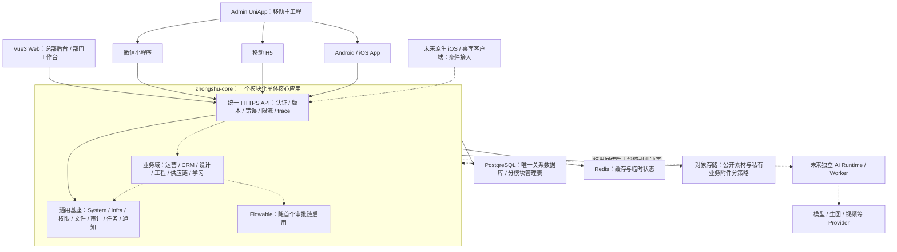

# 众墅之家 AI 赋能平台：现阶段底座开发清单与多端架构

> 日期：2026-09-08；版本：V1.0；状态：开发清单建议稿，待按业务决策收口。\
> 本轮完成需求、源码与复用边界核查，不实施后端、前端、数据库或外部集成。\
> 本文细化现有一期需求，不替代《一期底座需求规格与待决策台账》，不将 D-07、D-09、D-10、D-11 自动升级为已确认。

> 后续实施说明：本文“本轮”“当前目录”等现状描述保留为 2026-09-08 复制前审计快照。同日后续已完成完整源码迁入；最新实施事实以 [源码迁入与验证报告](../../docs/04-源码迁入与验证报告.md) 为准，详细二开次序以 [二次开发顺序与验收标准](../../docs/03-底座二次开发顺序与验收标准.md) 为准。本文的业务边界与待决项不因复制而改变。

## 1. 结论与需求边界

当前应建设的是“后续各业务条线共同使用的产品底座”，不是重新开发一个通用 RuoYi，也不是一次性迁入全部业务模块。

- 继续采用已确认的 JDK 17、PostgreSQL、模块化单体、Flowable、Vue3 Web、Admin UniApp 两条前端主线。[E01]
- 前端按运营、业务与设计、工程、商学院等工作台组织；后端按业务对象、规则和数据责任划分模块，不将一个部门直接等同于一个微服务。
- 直接复用 System/Infra/Framework 的技术机制；改造组织、权限、文件、导航、消息与审批；自研众墅特有的业务规则、跨组织服务授权和业务接入约定。
- 现有设计小程序后端是重要供体：已经存在审计、可靠事件、交付票据、导出任务、微信会话和 AI 任务代码，不能全部列为“从零自研”；但它也不是已经确认的全平台基座。[E04][E07][E08][E09]
- 多端支持的目标是“共享后端事实与权限契约、分别适配交互和设备能力”，不是一个页面原样运行于所有终端。
- 底座完成必须证明可独立构建、真实 PostgreSQL 可运行、两个组织隔离、多端权限一致以及一条业务链闭环；源码存在、测试文件存在、真机通过、生产验收分别登记。

完整源码保留为资产库，运行时按白名单启用。本次没有精简、删除或覆盖任何来源仓库，也没有重新拉取远端代码。

## 2. 本次核实到的真实现状

### 2.1 目录和版本

以下为本机 2026-09-08 快照，不是远端最新版本承诺。

| 资产 | 本地状态与版本 | 本次定位 |
|---|---|---|
| 产品主工程 `zhongshu-ai-platform` | 已有独立 Git；本轮修改前 HEAD 为 `5758eda`，工作树干净；版本化内容仅 README、两份方案/台账和 `.gitignore` | 唯一产品开发落点；Git 已建立，但没有迁入应用源代码 |
| 设计小程序后端 | 分支 `feat/zhongshu-design-v1`；HEAD `2bf21e528e8a73481c98d35a061eae60ad897f02`；工作树干净；JDK 17、Spring Boot 3.5.15 | RuoYi 同源专项供体，不能直接视为官方基线或全平台主身份模型 |
| Vue3 Admin | `a58e6de223b616b9dc14c95551d9d10faf5a280b` | 唯一 Web 主线 |
| Admin UniApp | `6929988b78bc00eaab3dff02cd52a463fb1a0467` | 小程序、H5、Android/iOS App 的移动主工程 |
| Vben Admin | `6062a0384e621d652865b5b3c44b4ff7b157eb78` | 局部交互参考，不形成第二管理端 |
| Vue2 Admin | `2862e9d45bd452c57301d0db64cbf87083521138` | 历史接口/页面参考，不进入新主线 |
| Mall UniApp | `88b5be678d08ce9a729d8395f8c25f80a274a54c` | 商品/SKU/订单/物流等局部页面供体，不作为员工登录与角色工作台底座 |

Git 快照通过各仓库的 `git rev-parse`、`git status` 取得。五套前端均为独立、非浅克隆仓库，工作树干净，未配置 `core.sparseCheckout`。这不代表本轮验证了所有远端分支、Git LFS 对象或历史依赖。

路径基准：

- 产品：[zhongshu-ai-platform](/Users/honor.pei/Documents/ruoyi/zhongshu-ai-platform)
- 前端来源：[ruoyi-vue-pro-full-source](/Users/honor.pei/Documents/ruoyi/ruoyi-vue-pro-full-source)
- 后端供体：[设计小程序后端](</Users/honor.pei/Documents/企业FDE项目/众墅之家设计小程序/后端程序>)
- 旧记录中的 `/Users/honor.pei/Documents/github/ruoyi-vue-pro` 和 `/Users/honor.pei/Documents/ruoyi/ruoyi-vue-pro` 当前不存在；实施阶段须恢复一个来源清晰、固定 SHA 的官方后端基线，不能靠旧路径推断。

六套已检查来源的根许可证文件均标识 MIT；迁入时仍须保留版权及许可证，并核对依赖、字体、图片、插件和供体新增内容各自的来源，不能以根许可证替代完整物料清单。

### 2.2 影响开发清单的五个事实

1. **已有账号，但没有统一的众墅平台身份模型。** 设计供体使用 `account / wechat_identity / design_access_grant / user_session`；会话查询不连接 `system_users`，没有发现已实现的全平台 Membership/跨组织角色关系。设计授权码不是员工组织任职关系。[E07]
2. **已有权限基础，但不是没有安全边界的空壳。** RuoYi 租户过滤器会校验登录用户与请求租户是否一致，应保留并扩展；不能简单允许客户端切换 `tenant-id`、`visit-tenant-id` 来实现总部跨加盟商服务。[E06]
3. **PostgreSQL 适配仍有确定缺口。** 当前供体的访问日志、错误日志、任务日志、Access Token、Refresh Token 五个 Mapper 仍有 `DELETE ... LIMIT`。专项 Flyway 配置还注明完整 System/Infra PG 启动验收另设门禁，因此不能声称“全底座 PG 已完成”。[E05][E10]
4. **文件存储不能直接等同于私有业务附件。** 通用文件下载方法带 `@PermitAll`、`@TenantIgnore`；它可服务公开资产，但不能直接承担合同、图纸、录音、付款凭证的私有下载。[E11]
5. **App 构建目标不等于 App 已交付。** Admin UniApp 有 H5、微信小程序、Android/iOS 构建脚本和 manifest 配置；现有工作台菜单可过滤部分权限，但 TabBar/普通路由还不是完整众墅角色导航。[E12][E13][E14]

## 3. 复用分类与一期开发工作包

“直接复用”指不重写成熟机制，仍须做版本固定、配置、安全与集成验证；“二开”指沿用实现补上众墅语义；“自研”指众墅规则由我们拥有，并非所有底层代码从零写。

优先级：A＝可立即推进的阶段 0/1A；B＝D-09 决策后的阶段 1B；C＝首条业务链或敏感数据接入前完成；D＝现阶段定义边界，具体业务/外部能力后接。以下 WP 编号是开发拆包编号，不是对现有 FND 完成状态的提升。

跨阶段工作包须分项登记，例如 `WP-12:A` 的存储机制通过，不代表 `WP-12:B/C` 的私有附件授权已通过；WP-05/10/13/15/24 等同理。主工作包只有该批承诺范围的各子项都有证据时才能标记完成。

### 3.1 工程、基础服务与交付能力

| 工作包 | 内容与复用来源 | 必须交付的二开/自研内容 | 优先级与验收 |
|---|---|---|---|
| WP-01 来源与工程治理 | 复用官方后端、两个主前端和专项供体；对应 FND-SRC-001～004 | 记录来源 URL/分支/SHA/许可证/供体差异；迁入独立产品目录，保留完整来源仓库只读 | A；目标无嵌套来源 `.git`，可定位每批迁入来源；开发不依赖其他项目目录 |
| WP-02 核心运行骨架 | 直接复用 Server、System、Infra、必要 Framework；模块当前启用情况见 POM [E04] | 白名单启用、配置分环境、密钥不入库；不整体带入设计、commerce、AI 等供体业务模块 | A；单一核心应用可独立构建启动，关闭模块不暴露入口或后台任务 |
| WP-03 PostgreSQL 全链适配 | 复用驱动、初始化 SQL、MyBatis 方言基础 [E05][E10]；对应 FND-DB-001～012 | 修复五类清理 SQL；核验分页、ID、JSON/布尔/时间、索引、Quartz、代码生成；固定 PG 版本及低权限运行账号 | A；空库与升级库均通过真实 PG 测试，应用不依赖 MySQL；不得只用 H2 证明兼容 |
| WP-04 版本化迁移 | 供体已有 Flyway profile、platform 迁移与 undo 脚本 [E05][E09] | 建议复用 Flyway 路线，目标选型仍按待决策台账收口；梳理 System/Infra 初始化与迁移衔接，不能照搬专项全模块 locations | A；空库连续两次引导结果一致，升级保留数据，失败可诊断；备份恢复/纠正迁移演练有证据 |
| WP-05 登录与会话机制 | 复用 System 登录、双 Token、退出、权限接口，以及两个前端请求封装 [E12][E13] | 统一错误与会话失效处理、刷新并发、设备会话、退出/停用撤权；不把设计 C 端账号直接替换员工账号 | A 做既有 System 技术链，B 接众墅身份；过期/撤销/重复刷新均有测试，前端无 Provider/微信服务端密钥 |
| WP-12 文件与交付 | 复用 Infra 存储适配器；供体已有一次性票据和导出状态实现 [E08][E11] | 增加业务对象/组织/字段敏感等级关联、私有下载授权、受控上传、用途/大小类型校验、过期及失败清理；票据发行和消费都检查当前业务授权 | A 存储机制，B/C 私有授权；组织 B 无法凭 A 的文件 ID、URL 或票据下载，过期/撤权受限；公开素材另走明确公开策略 |
| WP-13 审计与追踪 | 复用 System 日志及专项 AuditPort/JdbcAuditPort [E08][E09] | 记录操作者、有效身份/组织、对象、动作、结果、版本、原因、trace；脱敏、保留期、受控查询与防任意修改 | A 基础日志，B/C 业务授权审计；授权、下载、导出、状态修改均可回溯，普通业务账号不能改历史 |
| WP-14 任务、幂等与可靠事件 | 复用 Quartz、幂等基础；专项已有 Outbox、租约、重试、DEAD 和导出任务 [E08][E09] | 平台化组织上下文、幂等键范围、幂等消费者、重复/乱序处理、超时与失败回查；不新建第二套相同事件中心 | A 机制、C 接业务；事务回滚不发业务事件，重复投递不重复形成业务结果，失败可见可重试；不承诺 exactly-once |
| WP-15 通知与待办入口 | 复用 System 站内信模板/发送/已读机制 [E16] | 业务事件→正确接收身份→站内通知→有权限的业务详情；渠道发送状态与业务完成状态分离 | A 站内信、B/C 角色收件；没配置短信/微信也不丢业务待办，失权用户点旧链接被拒绝；外部渠道受 D-10 限制 |
| WP-19 运行、监控与配置 | 复用日志、任务记录、Redis、健康检查等现有技术机制 [E01][E04] | 核心应用+PG+Redis+对象存储的独立环境配置；探活、错误告警、任务积压、备份恢复、敏感配置管理 | A；可在独立环境启动和恢复，服务异常可定位，配置缺失不伪报成功；本轮不操作生产 |
| WP-20 测试、CI 与文档 | 复用上游相关测试及专项 PG 合同测试 [E09]；对应 FND-DOC-001～003 | TDD、PG 集成测试、多端合同测试、依赖/密钥检查、需求证据登记、同一套本地与 CI 文档检查 | A 起持续执行；每批迁入都有构建/测试报告，检查器实际运行后才标记已实现；源码、本地、CI、部署、UAT 分栏 |

### 3.2 众墅平台规则与多端接入

| 工作包 | 可复用基础 | 必须二开/自研的规则 | 优先级与验收 |
|---|---|---|---|
| WP-06 组织、人员与任职 | System 租户/部门/岗位/用户/角色 [E01][E06] | 明确总部、品牌、加盟商、门店、部门关系；账号、任职、客户身份分开；入职、停用、离职交接；多组织/多身份关系按 D-09 决策 | B；有书面关系模型与迁移方案；两组织人员不能互授角色，停用后原会话失权且历史保留 |
| WP-07 租户与对象数据权限 | Tenant/Data Permission 机制 [E06] | 映射 `tenant_id` 与业务 `tenant_org_id`；SELF/ASSIGNED/DEPARTMENT/FRANCHISEE 等策略，服务端产生可信上下文 | B；篡改租户头、对象 ID、批量 ID、导出条件不能跨组织；不得给每个部门各建一套客户库 |
| WP-08 动作与字段权限 | RBAC、菜单按钮权限和数据权限扩展点 [E06][E12] | 定义资源动作码、F0～F3、`authorized_fields`、`allowedActions`；读取、修改、下载、导出均在服务端重新校验 [E02] | B/C；页面隐藏后直接调 API 仍拒绝；敏感字段不出现在响应、导出或日志中；管理员默认汇总不等于任意明细 |
| WP-09 跨组织服务授权 | 复用权限框架，不原样复用“访问其他租户”作为业务授权 | 众墅自研 SERVICE_CASE 最小授权、原因/期限/对象/字段范围、撤销、审计；特批明细另设受控流程 [E02] | B/C，受 D-09 约束；授权过期或撤销后接口/文件同步失权；没有已验收策略的跨组织入口默认关闭 |
| WP-10 角色工作台与导航 | Vue3 动态路由、UniApp 菜单过滤/通用组件 [E12][E14] | 众墅工作台、导航注册表、TabBar、页面访问策略、消息落点和多角色组合；按终端绑定实际页面，不能将 Web 路由原样发给小程序执行 | A 容器，B/C 角色化；后台授予/撤销→重新取权→菜单/TabBar/直达页/API 一致；工作台切换不自动等同组织身份切换 |
| WP-11 稳定 API 与客户端契约 | 复用现有 REST、校验、接口文档、错误响应 [E12][E13] | 为众墅 API 固定版本与兼容策略、分页、错误码、trace、时间、字符串 ID/金额精度、幂等及并发版本约定；保留适配层减少对上游接口的侵入 | A/C；Web/小程序/移动客户端调用合同一致，旧移动包遇兼容变化有明确处理，不在前端各算一套权限或业务金额 |
| WP-16 审批与正式业务状态 | 复用 BPM/Flowable 模型、流程与待办能力 [E15] | 审批人资格、组织范围、流程版本、重复回调、撤回/驳回/转交；最终状态由领域服务检查并写入 [E01][E02] | C，D-07 后首流程启用；真实 PG 上完成提交/通过/拒绝/撤回等测试；“任务结束”不能直接变为付款/验收成功 |
| WP-17 业务对象、关联与版本规范 | 复用通用 DO、审计字段、校验、代码生成 | 自研各对象独立 ID、引用关系、责任分配历史、版本并发检查与事件契约 [E02] | A 定规范、C 首链实现；线索转商机、跨部门交接不复制出不可追溯的客户；旧版本修改有冲突提示，历史不被通用回滚覆盖 |
| WP-18 模块可用性与配置 | 复用租户套餐、菜单、字典、参数机制 [E01] | 区分“组织可用模块”“人员角色权限”“AI 配额/商业权益”；组织模块开关和安全默认值；品牌文案与配置按实际需要扩展 | A/B；未开模块不能靠旧入口调用；不预建计费平台，AI 额度/收费规则待 D-11 或相应业务确认 |
| WP-24 终端适配与验收 | Admin UniApp 已有微信/H5/App/iOS 构建入口 [E13][E14] | 登录提供方、上传/下载、预览、录音/相机、分享、通知、安全存储和长任务恢复适配；避免原生 API 散入业务代码 | A 定适配边界，小程序/Web 先验收；App/iOS 按实际交付批次完成签名、真机与权限测试；无凭据项明确未验证 |

### 3.3 现在约定接口、后续随业务实现的内容

| 工作包 | 现阶段应做什么 | 不应提前做什么 | 后续验收 |
|---|---|---|---|
| WP-21 AI 能力边界 | 记录已有 AI Job/身份/资产/审计供体，定义调用者、业务引用、输入版本、结果引用、取消/失败与人工采纳边界 [E04][E07][E17] | D-11 前不整体启用 `yudao-module-ai`，不部署空 AI Runtime，不选定模型/向量库，不强推第三方 AI 仓库 | 首场景确定后验证任务权限、重复回调、取消后晚到结果、费用记录、人工确认；只有真实 Provider 回执与产物才能认定集成完成 |
| WP-22 指标与管理视图 | 固定来源对象、统计粒度、时间窗口、口径版本、已确认/部分/不可得状态 [E02][E03] | 不在底座阶段建所有驾驶舱，不另造可以手填的成交/已发布事实表 | 第一条链的员工/负责人/老板视图从同一事实派生，缺失数据不按 0 充数 |
| WP-23 已有系统接入与账号映射 | 登记设计小程序、客资派发等系统的权威对象和对接责任；优先评估接口适配/事件对接，供体抽取保留测试 | 不共享生产数据库、不整体搬库、不把相同手机号/OpenID 当作自动合并账号的充分条件；不未经核对重写已实现模块 | 按后续批准范围完成身份绑定、来源 ID 映射、重复回传幂等、隔离与回退测试；历史迁移另设清单 |

## 4. 哪些业务模块可借鉴，哪些要自研

以下是后续业务能力的归属，不应全部计入一期底座工期。模块名称相似，不等于业务规则一致。[E01][E02]

| 业务条线/模块 | 可摘取的已有能力 | 众墅必须拥有的业务逻辑 |
|---|---|---|
| 运营/自媒体 | 通用任务、素材文件、通知、AI Job；现有专项内容能力按源码/测试核对后接入 | 渠道账号归属与运营人、内容版本与确认、发布回填、数据回采、客资来源与交接；“平台登录账号”与“抖音等渠道账号”分开 |
| 业务/CRM | CRM 客户、联系人、线索列表、跟进交互等低耦合片段 | 判重、分配、归属、超时回收、运营交接确认、商机转化、跨部门状态衔接；原 CRM 对象授权必须复核 |
| 设计 | 已有设计小程序的设计/资产/AI 任务供体；文件版本和评审流程机制 | 勘察→设计任务→专业审核→版本发布→交接；客户 C 端授权与员工设计权限不能混用 |
| 报价/合同/回款/提成 | BPM、Pay 支付渠道和回调等候选机制 | 报价及折扣权限、合同版本、应收期次、核验与核销、佣金规则；支付成功不自动等于业务核验或提成可发 |
| 工程 | 通用任务、文件、审批与通知 | 有效交接、开工授权、节点验收、质量整改、工程证据、变更与结算；工程模块不是简单套用项目 CRUD |
| 材料供应链 | Mall UniApp 商品/SKU/订单交互；后端 Mall/ERP/WMS/Pay 局部能力 | 工程 BOM 关联、分组织价格、内部价隔离、分批发货、到货验收、补货与对账；外部供应商按 P1 条件接入 |
| 商学院/学习 | 登录权限、文件/视频资源、任务、消息、进度记录的技术机制 | 课程、必学/推荐、岗位学习路径、考试认证与部门学习统计；当前运营页面已有学习入口要求，不应未经确认整体删到最后一期 |
| 总部/老板驾驶舱 | Report/图表与聚合查询机制 | 统一指标口径、授权汇总、例外下钻、跨条线归因；不能给总管理员默认全部敏感明细 |

上述业务源码是否能直接摘取，须以具体文件、上游差异、依赖和回归测试为准；本轮没有对 CRM/Mall/ERP/WMS 等所有内部业务实现做逐文件安全审计。

## 5. 建议的多端技术架构

### 5.1 部署与依赖关系

下图是目标结构，不是已运行部署。实线部分对应当前核心底座建设；虚线业务模块和 AI Runtime 按后续业务阶段启用。

单体是“核心业务模块先统一部署”，不是要求数据库、文件存储、AI 重任务都塞进同一进程；也不是把线索到回款的一生包成一个数据库事务。跨模块正式写入经领域接口完成，可靠事件用于异步后续动作；报表可采用受控只读聚合。

部门适合定义使用入口和责任人，业务边界应围绕业务能力及对象划分。微软的领域分析指南也强调以业务能力和有界上下文识别边界；本文据此推导模块边界，但不据此要求现在拆微服务。[领域分析说明](https://learn.microsoft.com/en-us/azure/architecture/microservices/model/domain-analysis)

### 5.2 每种前端怎样接入

| 终端 | 主工程/复用方式 | 本阶段必须满足的契约 | 实际发布时另验 |
|---|---|---|---|
| 桌面浏览器 Web | Vue3 Admin；管理表格、配置、审核及部门工作台 | 统一账号上下文、资源权限、API 和业务状态 | 浏览器兼容、响应式、上传下载、会话安全 |
| 微信小程序 | Admin UniApp，众墅导航/页面二开 | 页面在包内登记，服务端只返回允许的入口与数据；任务查询可恢复 | 真实 AppID/登录绑定、域名、隐私授权、分享/订阅消息、开发者工具与真机 |
| 移动 H5 | 同一 UniApp 移动工程按需构建 | 共用 API，不将小程序专属登录/分享 API 写死到业务逻辑 | 浏览器媒体能力、下载/预览、跳转和登录回调 |
| Android / iOS App | 先沿用 UniApp 的 App 构建能力；iOS 是 App 的平台目标 | 原生能力放适配层，统一任务恢复、会话和版本兼容 | 签名、证书、插件、权限弹窗、安全存储、弱网与前后台切换、真机；上架单独验收 |
| 未来 Swift 原生 iOS | 如果原生体验需求成立，新增客户端消费同一 API | 后端不依赖 Vue、UniApp 或微信对象，接口文档完整 | 原生 UI/SDK 单独开发，不能声称复用 Vue 页面代码 |
| 未来桌面应用 | 先满足 Web；确有设备/离线需求再定方案 | 同一 API 与授权规则 | 当前没有桌面构建/运行证据，不提前选 Electron/Tauri |

UniApp 官方明确多端存在平台特性差异，并提供条件编译处理 API、组件、样式和页面差异；因此本方案不承诺“一套代码无需修改覆盖所有端”。[UniApp 多端差异说明](https://uniapp.dcloud.net.cn/tutorial/platform.html)

### 5.3 从第一天固定的接口原则

1. **身份与终端分离。** Web、小程序、App 是登录渠道；有效账号/组织/角色由服务端确认。微信身份保留应用维度，不拿单个 OpenID 当全平台通用账号。是否统一 C 端与员工自然人账号属于 D-09。
2. **有稳定版本合同。** 为众墅业务 API 定版本和兼容窗口；现有 RuoYi 管理 API 可保留适配，避免全量改路径。长整型 ID 用字符串传输，金额精度、日期时区、分页和错误码有明确测试样例。
3. **权限结果跨端一致。** 服务端返回当前可访问工作台、资源权限及允许动作；已编译的小程序页面通过本地注册表映射。模块开关、菜单可见、对象授权是三层不同判断。
4. **长任务可离开可恢复。** 请求取得任务 ID 后回查状态，必要时接推送并保留轮询恢复；离开小程序/锁屏不要求长连接保持。取消、超时、失败、重试、结果过期都可辨别。
5. **结果与业务决定分离。** AI 生成成功、文件上传成功、审批任务结束、支付渠道回调各是不同事实，不能互相替代正式业务确认。
6. **跨端重试不重复执行业务。** 客户端重发携带同一幂等标识；后端校验请求范围、内容和业务版本。并发更新、重复提交与晚到回调有明确结果，不靠按钮置灰保证正确。
7. **文件凭据不能长期泄漏。** 公共素材明确公开，私有附件经对象授权后发放短时访问；高敏感文件采用可撤销/一次性受控交付。普通已发出的存储签名 URL 无法被业务撤权立即回收时，必须有明确短 TTL 或受控代理策略，不作即时撤销承诺。

## 6. 每个后续业务模块应遵守的接入清单

业务模块不需要各自重新建设用户中心、文件中心和消息中心，但必须提供自己的业务规则。首次接入时交付以下八项：

| 接入项 | 要求 | 可验证的完成标准 |
|---|---|---|
| 对象与数据责任 | 每种对象独立 ID，说明权威归属和上游引用 | 同一条线索/客户/项目可按 ID 追溯，不把所有对象塞进万能表 |
| 状态与版本 | 列出状态、合法动作、前置条件、版本并发与纠错规则 | 非法跳转被服务端拒绝，旧版本更新不能覆盖新版本 |
| 组织与授权 | 租户、归属、分配、角色动作、字段策略、跨组织授权 | 两组织+多角色正反向用例同时通过 |
| 工作台与页面 | 登记 Web/移动页面、入口、适配要求、无权限/空/加载/失败状态 | 菜单进入、深链接、刷新返回、消息跳转均有正确结果 |
| 文件与证据 | 业务附件、版本、敏感级别、保留/删除规则 | 下载、预览、分享、导出使用同一授权边界 |
| 流程与消息 | 领域动作、审批事件、接收人、幂等规则 | 重复审批回调/通知不重复生成正式事实，接收人失权不可继续操作 |
| 指标与 AI | 数据来源、口径、允许发送给 AI 的最小字段、人工采纳点 | 汇总可回溯，敏感数据不越权进入提示词/检索结果 |
| 交付与验证 | 需求、迁移、API、单元/PG/端到端测试、外部验收清单 | 代码存在和生产可用分别记录，有可复现的测试步骤 |

`tenant_org_id`、`owner_org_id`、`status`、`data_version` 等遵循 DESIGN；`assignment` 独立记录主责、协同和有效期；生命周期 `stage` 是派生视图，不与各对象正式 `status` 双写。[E02]

## 7. 实施批次、决策门与验收

| 批次 | 当前可做范围 | 依赖/停止边界 | 完成证据 |
|---|---|---|---|
| 0：来源与可运行工程 | WP-01～04、19、20；迁入最小后端和两条前端主线 | 不需要等 D-07/D-09；上游精确版本、迁移工具、PG 环境须收口 | 来源清单、依赖锁定、独立构建、PG 空库/升级、基础启动及文档检查 |
| 1A：通用技术闭环 | WP-05、10～15、18、24 的技术部分 | 可沿用 System 技术账号验证；不固化众墅多身份，不引入真实客户敏感数据 | 登录/退出/刷新→取权→页面→API→任务/文件/通知→审计；Web 与小程序可复现 |
| 1B：众墅组织与授权 | WP-06～09 及相关文件、会话、导航改造 | 必须先解决 D-09；没有批准的跨组织模型则对应入口关闭 | 两组织+员工/负责人/总部角色的对象、字段、批量、下载、导出隔离报告 |
| 2：第一条薄业务链 | WP-16、17 和其他能力的真实业务接入 | D-07 确定第一条链；现有建议“加盟商开通—首条线索闭环”尚不是已批准范围 | 从入口、操作、异常、交接、消息到下一动作完整演示；真实角色 UAT 单列 |
| 3：按业务价值扩展 | 运营、业务设计、工程、供应链、学院、看板；WP-22/23 随场景实施 | 不按部门同时复制一整套后台；已有系统先核对复用再实现缺口 | 每条业务链独立迁移、测试、验收，有跨部门衔接 |
| 4：真实外部接入与更多终端 | D-10 的微信/支付，D-11 的 AI Runtime/Provider，Android/iOS 真机发布 | 真实账号、证书、合同与费用规则按需提供；不阻塞前面的无凭据技术工作 | 真实回执/产物/回调、失败处理、真机操作、发布验收分别留证 |

D-09 应收口的是：哪些主体拥有账号、C 端客户是否与员工共用自然人账号、一个账号能否多组织任职、角色如何绑定任职、总部服务其他组织的合法路径、停用/离职的生效规则。建议先画关系与权限矩阵，再定表；不因出现“多端”就擅自定为“一账号多身份”。

D-10/D-11 延后不等于架构不考虑：现在不把身份绑定到单个 AppID、不把长任务绑定到小程序前台连接、不把生成结果直接写成业务批准状态；具体商业与供应商实现仍后置。

## 8. 关键风险与验收底线

| 风险 | 处理方式 | 必须取得的证据 |
|---|---|---|
| 供体身份与 System 不兼容 | 分清 C 端、员工、组织任职，按 D-09 设计映射，不全量复制 account 表 | 绑定/解绑、禁止错误合并、失权和历史归属测试 |
| 专项 PG 能跑而全底座不能跑 | 修复五类 SQL、核验初始化→迁移→完整应用，保留低权限账号 | 真实 PG 的 System/Infra/Quartz/登录/清理测试；BPM 启用时补对应测试 |
| 菜单正确但敏感信息泄露 | 同时检查 API、对象、字段、文件、导出、AI 上下文，不信任前端租户头 | 绕过 UI 直接请求、伪造对象/组织、批量混入非法 ID 的反向测试 |
| 复用票据/Outbox 后误认无需二开 | 将租户上下文、当前授权、幂等消费者和审计接到现有机制上 | 过期、撤销、并发消费、重复投递、失败重试与晚到结果测试 |
| 所有业务提前进入底座 | 只做公共能力和第一个闭环，其他模块登记边界与接入清单 | 运行模块白名单、依赖图中没有空 Runtime/无关业务入口 |
| 宣称 iOS 已支持但只有脚本 | 将接口兼容、构建、模拟器、真机、外部能力、上架分开 | 每个承诺终端都有对应报告，缺证书/账号的项目明确未验证 |
| 来源/需求版本漂移 | 主台账管决策，DESIGN 管冻结业务规则，专项页面冲突登记 | 来源 SHA、规则版本、差异与批准记录同步，不能由效果图覆盖冻结权限 |

容量不在本轮凭框架名称估算。第一条链确定后，按实际并发角色、文件/视频大小、AI 长任务量和通知量制定负载模型，记录吞吐、P95/P99、错误率、资源占用和积压恢复；在实测前不承诺某个 QPS 或门店数。

本轮验收仅针对清单文档：核对来源文件、分级和门禁；检查链接、编号、表格与版本一致性。未执行应用构建、数据库初始化、专项测试重跑、真机或外部 Provider 测试，不能据本报告升级任何产品运行能力的状态。

本轮文档核验记录：24 个工作包编号唯一，47 处本地链接有效，原有 68 项需求定义不变；README/方案/台账版本和变更记录一致，`git diff --check` 通过，六套来源工作树保持干净。独立只读评审无阻断，并已采纳“跨阶段工作包分项登记”的建议。这些是本次临时文档核验，不代表 FND-DOC-003 的可复用自动检查器或 CI 已交付。

## 9. 主要证据索引

E01 为当前已确认的需求/决策；E02/E03 为业务规格与专项页面分析。E04～E17 是当前来源代码证据，不是目标主工程已经实现或运行通过的证据。

[E01]: /Users/honor.pei/Documents/ruoyi/zhongshu-ai-platform/docs/02-一期底座需求规格与待决策台账.md
[E02]: </Users/honor.pei/Documents/企业FDE项目/乡墅运营赋能/赋能平台 V2 版项目/DESIGN.md:221>
[E03]: </Users/honor.pei/Documents/企业FDE项目/乡墅运营赋能/赋能平台 V2 版项目/全流程梳理0826/运营板块小程序前端页面与全流程梳理_20260905.md:50>
[E04]: </Users/honor.pei/Documents/企业FDE项目/众墅之家设计小程序/后端程序/pom.xml:10>
[E05]: </Users/honor.pei/Documents/企业FDE项目/众墅之家设计小程序/后端程序/yudao-server/src/main/resources/application-pg.yaml:1>
[E06]: </Users/honor.pei/Documents/企业FDE项目/众墅之家设计小程序/后端程序/yudao-framework/yudao-spring-boot-starter-biz-tenant/src/main/java/cn/iocoder/yudao/framework/tenant/core/security/TenantSecurityWebFilter.java:65>
[E07]: </Users/honor.pei/Documents/企业FDE项目/众墅之家设计小程序/后端程序/yudao-module-identity/src/main/java/cn/iocoder/yudao/module/identity/session/UserSessionService.java:73>
[E08]: </Users/honor.pei/Documents/企业FDE项目/众墅之家设计小程序/后端程序/yudao-module-infra/src/main/java/cn/iocoder/yudao/module/infra/zhongshu/delivery/JdbcDeliveryPort.java:30>
[E09]: </Users/honor.pei/Documents/企业FDE项目/众墅之家设计小程序/后端程序/yudao-server/src/test/java/cn/iocoder/yudao/ZhongshuReliableEventAuditDeliveryContractTest.java:51>
[E10]: </Users/honor.pei/Documents/企业FDE项目/众墅之家设计小程序/后端程序/yudao-module-system/src/main/java/cn/iocoder/yudao/module/system/dal/mysql/oauth2/OAuth2AccessTokenMapper.java:49>
[E11]: </Users/honor.pei/Documents/企业FDE项目/众墅之家设计小程序/后端程序/yudao-module-infra/src/main/java/cn/iocoder/yudao/module/infra/controller/admin/file/FileController.java:101>
[E12]: /Users/honor.pei/Documents/ruoyi/ruoyi-vue-pro-full-source/yudao-ui-admin-vue3/src/permission.ts:28
[E13]: /Users/honor.pei/Documents/ruoyi/ruoyi-vue-pro-full-source/yudao-ui-admin-uniapp/package.json:1
[E14]: /Users/honor.pei/Documents/ruoyi/ruoyi-vue-pro-full-source/yudao-ui-admin-uniapp/src/tabbar/config.ts:90
[E15]: </Users/honor.pei/Documents/企业FDE项目/众墅之家设计小程序/后端程序/yudao-module-bpm/src/main/java/cn/iocoder/yudao/module/bpm/service/task/BpmProcessInstanceServiceImpl.java:98>
[E16]: </Users/honor.pei/Documents/企业FDE项目/众墅之家设计小程序/后端程序/yudao-module-system/src/main/java/cn/iocoder/yudao/module/system/service/notify/NotifySendServiceImpl.java:35>
[E17]: </Users/honor.pei/Documents/企业FDE项目/众墅之家设计小程序/后端程序/yudao-module-ai-orchestration/src/main/java/cn/iocoder/yudao/module/aiorchestration/controller/app/AppAiJobController.java:21>

补充源码定位：

- [访问日志清理](</Users/honor.pei/Documents/企业FDE项目/众墅之家设计小程序/后端程序/yudao-module-infra/src/main/java/cn/iocoder/yudao/module/infra/dal/mysql/logger/ApiAccessLogMapper.java:42>)、[错误日志清理](</Users/honor.pei/Documents/企业FDE项目/众墅之家设计小程序/后端程序/yudao-module-infra/src/main/java/cn/iocoder/yudao/module/infra/dal/mysql/logger/ApiErrorLogMapper.java:41>)、[任务日志清理](</Users/honor.pei/Documents/企业FDE项目/众墅之家设计小程序/后端程序/yudao-module-infra/src/main/java/cn/iocoder/yudao/module/infra/dal/mysql/job/JobLogMapper.java:40>)、[Refresh Token 清理](</Users/honor.pei/Documents/企业FDE项目/众墅之家设计小程序/后端程序/yudao-module-system/src/main/java/cn/iocoder/yudao/module/system/dal/mysql/oauth2/OAuth2RefreshTokenMapper.java:33>)。
- [Outbox 领取与重试](</Users/honor.pei/Documents/企业FDE项目/众墅之家设计小程序/后端程序/yudao-module-infra/src/main/java/cn/iocoder/yudao/module/infra/zhongshu/delivery/OutboxDispatcherService.java:48>)、[审计实现](</Users/honor.pei/Documents/企业FDE项目/众墅之家设计小程序/后端程序/yudao-module-infra/src/main/java/cn/iocoder/yudao/module/infra/zhongshu/audit/JdbcAuditPort.java:22>)、[平台表迁移](</Users/honor.pei/Documents/企业FDE项目/众墅之家设计小程序/后端程序/yudao-module-infra/src/main/resources/db/migration/platform/V20260905.003__p1c_platform_tables.sql:1>)。
- [移动端用户与权限](</Users/honor.pei/Documents/ruoyi/ruoyi-vue-pro-full-source/yudao-ui-admin-uniapp/src/store/user.ts:80>)、[移动页面登录拦截](</Users/honor.pei/Documents/ruoyi/ruoyi-vue-pro-full-source/yudao-ui-admin-uniapp/src/router/interceptor.ts:16>)、[App 配置](</Users/honor.pei/Documents/ruoyi/ruoyi-vue-pro-full-source/yudao-ui-admin-uniapp/manifest.config.ts:24>)。
