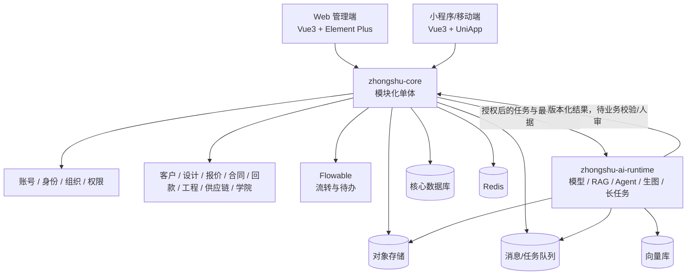

# 众墅之家 AI 赋能平台：底座代码复用与改造方案

> 文档版本：V0.12（品牌与代码命名专项同步稿）\
> 编制日期：2026-08-29  
> 最后同步：2026-09-08\
> 状态：D-01～D-06、D-08 已确认；其余决策按阶段跟踪  
> 适用阶段：底座选型与一期需求基线，不代表已实施  
> 实施边界：完整主工程源码及隔离供体差异已迁入产品 Git；来源仓库未改；当前特性分支归档不代表业务二开、真实集成或上线验收完成
> 关联需求：[一期底座需求规格与待决策台账](02-一期底座需求规格与待决策台账.md)
> 细化任务：[底座模块分析与开发任务清单](05-底座模块分析与开发任务清单.md)；每轮按众墅要求记录现有代码差距和修改任务，不改变需求/决策权威关系

2026-09-08 模块分析进展：M01～M12 已完成关键入口与需求差距的静态分析；评审与新增品牌专项后累计 91 项主任务（83 待开发、2 待决策、6 待前置），其中 25 项拆为 57 个不重复计数的分批子项。复用 System/Infra、会话、权限、存储、日志、消息、调度、Flowable 和两个前端壳；补齐实际 PG/Web 基础管理回归，并明确上传确认后的资产不可变性、主体绑定下载及撤权/续传边界。依赖按早期交付和后续扩展分别验收，组织、首链和外部接入仍遵守 D-07/D-09/D-10/D-11；本轮仅修订文档，不提升运行验收状态。

新增品牌与命名边界：采用用户提供的“众墅之家”Logo/展示名，拟统一产品前缀 zszj（zs 仅作登记缩写），从 B01 同步改造后端模块/命名空间/配置/产物与两端展示，B02/B03/B05 验存量兼容，B06 联合收口。具体以 02 的 FND-BRAND-001～003 和 05 的 ZS-BRAND-001～006 为准；不改原始来源、许可证、历史证据或未经批准的外部标识。本版只归档原图和登记任务，当前目录/源码名称尚未改变。

---

## 1. 结论先行

建议采用“**同源主底座 + 两个主前端 + 专项代码供体 + 独立 AI 运行时**”的组合：

| 层级 | 推荐选择 | 定位 |
|---|---|---|
| 核心后端 | [RuoYi-Vue-Pro](https://github.com/YunaiV/ruoyi-vue-pro) `master-jdk17` 线，审核后固定到精确 commit SHA | 众墅业务核心、账号组织权限、流程、基础设施的主底座 |
| 核心数据库 | PostgreSQL，实施前核验本地服务器版本，优先 17、可接受 16 | 从第一天作为唯一关系数据库基线，不再先用 MySQL 后迁移 |
| Web 管理端 | 本地 `yudao-ui-admin-vue3` | 唯一主 Web 管理端 |
| 小程序/移动端 | 本地 `yudao-ui-admin-uniapp` | 唯一主移动端工程壳 |
| 商城能力供体 | 本地 `yudao-ui-mall-uniapp` + 后端 Mall/ERP/WMS/Pay 模块 | 只摘取 SKU、订单、支付、售后、物流等低耦合能力 |
| AI 基础能力 | AI 阶段优先评估 `yudao-module-ai` 的模型、对话、知识库基础 | 一期底座先关闭 AI 模块，避免在没有首个场景时预建空抽象 |
| AI 增强供体 | [ageerle/ruoyi-ai](https://github.com/ageerle/ruoyi-ai)、[KMatrix](https://github.com/mahoneliu/KMatrix-service) | 借鉴 Agent、RAG、Rerank、工作流编排等专项能力，不整体替换主底座 |
| 未来微服务路线 | [Yudao Cloud](https://github.com/YunaiV/yudao-cloud) | 仅在出现明确独立扩容/发布/故障隔离需求后评估 |

核心判断：

1. **新项目固定同源 JDK 17 主基线。** 2026-08-29 检查过的旧本地后端为 Java 8、Spring Boot 2.7.18；该目录当前不存在。2026-09-08 找到的设计小程序供体已是 JDK 17，但它是专项二开分支，不自动替代经审核固定 SHA 的官方主基线。
2. **不更换为另一套完整 RuoYi 二开。** 本地 5 套前端已经与 RuoYi-Vue-Pro/Yudao 接口、权限和模块体系对齐，整体换底座会产生高额的认证、租户、权限、流程和接口迁移成本。
3. **不把“全后端”理解成“所有模块全部启用”。** 全量源码是代码资产库；一期先启用必要 Framework、System、Infra，Flowable 随首个审批链启用，AI 和其他业务模块按需求后接。
4. **不同时维护 5 套前端产品。** 5 套源码都参与评估，但最终只保留一个 Web 主工程和一个移动端主工程，其余作为局部供体或历史参考。
5. **P0 采用模块化单体，AI 运行时在 D-11 场景确定后独立部署。** 核心领域写入使用必要的短事务，不把全生命周期合为一个事务；耗时模型/RAG/生图任务后续从核心进程隔离。当前不部署空 AI Runtime。
6. **PostgreSQL 从第一天成为唯一关系数据库。** 当前上游具备 PostgreSQL 驱动、初始化脚本和方言基础，但仍需先修复已识别的 MySQL 专用 SQL，并用真实 PostgreSQL 完成 System/Infra/BPM 回归。

---

## 2. 本次评估目标与停止条件

### 2.1 目标

本方案回答四个问题：

1. 本地完整后端和 5 套前端中，哪些可以直接成为底座；
2. 哪些只能保留技术机制、必须按众墅业务改造；
3. 哪些核心业务不能套用通用模块，必须自研；
4. GitHub 上是否存在更适合的 RuoYi 二开，以及它们应处于什么位置。

### 2.2 本轮停止条件

本轮文档同步到以下结果即停止，不进入编码：

- 新项目目录已经建立；
- 复用、改造、自研和排除边界形成可审核文档；
- 主底座、前端、AI 和演进路线有明确建议；
- 待决策项完整列出；
- 已确认决策和待决策事项在复用方案、需求规格和 README 中保持一致；
- 文档同步、实施证据登记和自动一致性检查具备可追踪需求编号；
- 下一阶段按需求规格进入“固定版本、PostgreSQL 适配、迁入第一批底座代码”。

---

## 3. 需求理解与业务基线

### 3.1 平台定位

众墅之家 AI 赋能平台不是单一 CRM，也不是一个 AI 聊天壳。它是一个面向平台总部、品牌/部门、加盟商、门店/员工、供应商等多组织、多身份、多角色的业务协作平台：

- 小程序/移动端承担日常作业；
- Web 端承担总部配置、管理、审核和运营；
- 后端共享账号、组织、权限、业务对象和审计数据；
- AI 参与内容、设计、知识问答和经营辅助，但不代替关键业务审批。

### 3.2 统一业务主链

底座必须承载并贯通以下对象，而不是把它们拆成互不关联的演示页面：

`线索/客户 → 商机 → 勘察 → 设计 → 报价 → 合同 → 应收/回款 → 项目交接 → 工程节点 → 供应链/财务`

同时存在横向赋能模块：

- 方法论与内容任务；
- AI 话术、方案、知识库与经营助手；
- 学院、课程、考试与认证；
- 供应链 SKU、采购、履约和售后；
- 老板/管理者经营看板；
- 多品牌文案、导航和配置。

### 3.3 不可破坏的业务约束

1. `tenant_org_id` 由服务端身份上下文确定，客户端不得任意写入或切换。
2. 后端业务对象保持独立，前端可通过“工作台”和“客户 360”组合展示，不能为了少页面而合并数据模型。
3. 页面权限不只控制“能否进入”，还要控制字段等级、可见范围和动作集合，例如 `authorized_fields`、`allowedActions`。
4. 正式设计、最终报价、合同、工程验收、佣金和处罚等关键决定必须保留人工授权门禁。
5. 流程引擎负责流转和待办，业务状态机负责正式业务状态；不得让流程实例状态取代合同、回款、工程等领域状态。

### 3.4 本方案采用的需求版本关系

- 业务对象和关键规则以已冻结的 V2.0 业务链与安全边界为底线；
- 页面组织和角色工作台采用后续 V2.2 的“合并呈现、对象不合并”思路；
- 两者不冲突：一个约束后端事实，一个优化前端呈现。

---

## 4. 本地源码资产盘点

2026-09-08 复核到五套完整前端与一套 JDK 17 设计专项后端供体，均为独立 Git 仓库；旧后端路径已失效。已从供体保留的官方 Git 对象导出固定 JDK 17 基线，并复制两个主前端。最新落位、精确 SHA 和验证见[源码迁入与验证报告](04-源码迁入与验证报告.md)；开发拆包见[二次开发顺序与验收标准](03-底座二次开发顺序与验收标准.md)。

| 序号 | 本地目录 | 当前用途判断 | 后续角色 |
|---|---|---|---|
| 1 | [设计小程序后端](</Users/honor.pei/Documents/企业FDE项目/众墅之家设计小程序/后端程序>) | RuoYi 同源 JDK 17 专项供体，保留通用模块并新增 identity/design/commerce/ai-orchestration | 官方基线 `8e43004…` 已全量导出；专项差异隔离至 `reference/donors/zhongshu-design` |
| 2 | `../ruoyi-vue-pro-full-source/yudao-ui-admin-vue3` | Vue 3 + Element Plus 管理端 | **主 Web 底座** |
| 3 | `../ruoyi-vue-pro-full-source/yudao-ui-admin-vben` | Vben 管理端，工程与组件体系较重 | AI 控制台/交互模式参考，不作为第二主后台 |
| 4 | `../ruoyi-vue-pro-full-source/yudao-ui-admin-vue2` | Vue 2 旧版管理端 | 旧接口/旧页面行为对照，不进入新产品运行时 |
| 5 | `../ruoyi-vue-pro-full-source/yudao-ui-admin-uniapp` | Vue 3 + UniApp 管理移动端 | **主小程序/移动端底座** |
| 6 | `../ruoyi-vue-pro-full-source/yudao-ui-mall-uniapp` | 商城型 UniApp | SKU、商品、订单、支付、物流、售后等局部供体 |

### 4.1 当前版本事实

- 当前后端供体分支 `feat/zhongshu-design-v1`，SHA `2bf21e528e8a73481c98d35a061eae60ad897f02`；POM 为 Java 17、Spring Boot 3.5.15、`2026.08-SNAPSHOT`；未核验远端最新提交。
- 旧后端路径 `../ruoyi-vue-pro` 当前不存在；不要再把历史 JDK 8 快照描述为当前本地版本。
- 本次官方导入基线固定为 `8e43004cf68a405cd3485f98f8a539b97ca6544a`，已核对官方提交与本地 Git 对象；不是远端最新版本承诺。2026-08-29 的 `bff1706…` 仅为历史评估快照，不再作为导入候选。
- 本地 Vue3 管理端使用 Vue 3、Element Plus、Vite、TypeScript，适合作为新 Web 主线。
- 本地 5 套前端与后端在登录、菜单、权限、字典、文件和模块 API 上属于同一生态，这是选择同源底座的最大工程优势。

### 4.2 工作树保护结论

- 外层 `ruoyi` 目录不是 Git 仓库；
- 6 套源码分别有自己的 Git 历史；
- 5 套前端当前工作树干净；
- 当前设计专项后端供体工作树干净；历史后端未跟踪分析文档的记录仅适用于 2026-08-29 旧路径快照；
- 产品目录已有独立 Git，本轮从 `5758eda` 建立迁入分支；三份完整主工程与一份专项差异快照已迁入，共 13,939 文件；数据库和众墅产品规则未实施；
- 本轮不修改、不清理、不提交这些来源仓库。

### 4.3 本次复核补充

- 专项后端已有 Flyway、Outbox、审计、导出任务、一次性票据和设计 AI Job，优先评估迁入，不重复从零建设。
- 专项 `account/user_session/design_access_grant` 是设计 C 端身份体系，没有已统一到 `system_users` 或全平台组织任职关系的证据；D-09 保持待决。
- 五类清理 Mapper 仍包含 `DELETE ... LIMIT`，完整 System/Infra PostgreSQL 验收未闭环。
- 通用文件下载保留公开路径，敏感业务附件必须额外接对象/组织/字段授权。
- Admin UniApp 已有 Android/iOS 构建目标，但角色 TabBar、直达页面、设备能力和真机仍须二开与验收；Vue3 与 UniApp 是两条主线，不是所有终端共用同一页面。

完整文件来源见 `third_party/source-copy-manifest.json`；25 个文件的演示凭据净化见 `third_party/source-sanitization.json`。后端默认 21 模块打包通过；785 个测试中 767 通过、18 跳过，属于 H2/jedismock 基线测试而非 PG 验收。Web 生产构建通过、类型检查失败；小程序离线依赖不足，构建未执行。源码治理需求的分层证据登记在主台账第 9.3 节；不提升众墅业务运行能力状态。

---

## 5. 复用分级标准

| 级别 | 含义 | 处理方式 |
|---|---|---|
| D：直接复用 | 技术职责与众墅目标基本一致，不包含错误业务语义 | 固定上游版本后迁入，做品牌、包名、配置和安全核验 |
| A：改造复用 | 机制可用，但数据模型、边界、权限或流程语义不同 | 保留成熟实现，围绕众墅领域模型重写接口或扩展点 |
| R：参考借鉴 | 适合学习交互、算法或实现方式，整体迁入会制造耦合 | 记录出处，按目标架构重新实现或摘取极小的独立片段 |
| N：不采用 | 技术过时、重复维护、破坏关键约束或引入不必要复杂度 | 不进入目标运行时，仅保留审计记录 |

判定原则：

- 先复用已有工具和机制，再引入新抽象；
- 业务语义优先于“模块名字看起来相同”；
- 少复制一个模块，往往比复制后长期删改更安全；
- 所有迁入代码都需要来源仓库、分支/标签、commit SHA 和原路径记录。

---

## 6. 可以作为底座直接复用的内容

### 6.1 后端技术底座（D）

| 能力 | 可复用内容 | 复用说明 |
|---|---|---|
| 通用工程骨架 | 多模块 Maven、统一依赖、配置分层、统一响应、异常、校验、分页 | 只保留目标工程实际需要的模块 |
| 登录与会话 | Spring Security、Token/OAuth2、登录上下文、接口鉴权 | 账号机制可复用；身份/组织上下文按 D-09 改造，仅在 D-09 确认支持多身份时提供切换 |
| RBAC | 用户、角色、菜单、按钮权限、服务端权限校验 | 作为基础权限层，不能替代字段和组织数据权限 |
| 基础组织 | 用户、部门、岗位的后台管理能力 | 作为平台内部管理基础，不直接等同加盟商业务组织 |
| 系统管理 | 字典、参数、通知公告、登录日志、操作日志、在线用户 | 可直接进入管理底座 |
| 基础设施 | 文件存储抽象、Redis、缓存、分布式锁、幂等、限流、WebSocket、SSE | 迁入后重新配置安全边界和超时 |
| 异步与运维 | 定时任务、消息队列适配、监控、健康检查 | 按实际部署环境启用，不全量打开 |
| 开发效率 | Excel 导入导出、接口文档、代码生成、测试脚手架 | 代码生成仅用于初始 CRUD，生成后纳入正常维护 |
| 测试基础 | Framework/System/Infra 已有测试模式和测试工具 | 作为新项目测试规范起点，而不是把上游绿灯当业务验收 |

后端框架中已经存在 tenant、data-permission、security 等独立 starter。**它们的技术拦截机制可直接复用，但众墅组织语义和授权模型属于改造项**，见第 8 章。

### 6.2 Web 管理端（D）

`yudao-ui-admin-vue3` 建议直接复用：

- 登录态和用户信息 Store；
- 动态菜单与路由生成；
- 菜单/按钮权限指令；
- Axios 请求、Token 刷新、统一错误处理；
- 字典、上传、表单、表格、分页、CRUD 页面模式；
- 布局、主题、标签页、面包屑和通用组件；
- 与后端 System/Infra 模块已经对齐的 API 契约。

需要注意：这里的“直接复用”指工程外壳与技术组件，不代表沿用原有产品菜单和页面信息架构。

### 6.3 小程序/移动端（D）

`yudao-ui-admin-uniapp` 建议直接复用：

- UniApp 多端构建工程；
- 登录态、请求封装、路由守卫和错误处理；
- 上传、表单、列表、分页、消息提示等基础组件；
- 小程序/App/H5 平台差异处理；
- 与同源后端的基础接口契约。

主导航、工作台、角色首页和业务页面要按众墅 IA 重写，但无需重建整套移动端基础设施。

### 6.4 商城端的限定复用（D/R）

`yudao-ui-mall-uniapp` 不作为主小程序，但以下内容可按功能逐项评估：

- 商品/SKU 选择器；
- 商品详情和规格组合；
- 地址、订单、支付状态、物流跟踪；
- 售后申请和进度；
- 优惠券/营销组件（仅在确认业务需要时）。

复用时必须从“消费者商城语义”转换为“加盟商/项目供应链语义”，不能原样沿用购物车和零售订单模型。

---

## 7. 五套前端的最终取舍

| 前端 | 结论 | 原因 |
|---|---|---|
| Admin Vue3 | D，主 Web | 与后端同源、技术栈现代、已有完整权限/路由/HTTP/组件基础 |
| Admin Vben | R，交互供体 | 可参考复杂控制台和 AI 工作区，但与主 Web 并行会造成两套组件、权限和发布链 |
| Admin Vue2 | N，历史参考 | 新项目继续使用 Vue2 会增加长期维护与升级成本 |
| Admin UniApp | D/A，主移动端 | 基础设施直接复用，众墅角色工作台和业务 IA 重写 |
| Mall UniApp | R/D，商城供体 | 商业组件成熟，但不是众墅员工/加盟商的主应用结构 |

因此，“参考 5 套完整前端”不等于“生产维护 5 个前端”。目标是最大化资产复用，同时把长期产品面收敛为：

1. 一个 Web 管理端；
2. 一个小程序/移动端；
3. 必要时在同一 Web 工程中提供 AI 工作区，而不是另起第二套后台。

---

## 8. 必须改造后才能复用的内容

### 8.1 账号、身份与组织（A）

通用 RuoYi 的“用户—部门—角色”可能不足以表达众墅业务。以下四个概念仅作为 D-09 的候选设计输入，不是已确认数据模型；D-09 确认前不得据此创建表结构或固化一个账号多身份规则：

| 概念 | 职责 |
|---|---|
| Account | 登录账号、手机号/微信绑定、认证凭据、全局状态 |
| Identity/Membership | 一个账号在某组织中的业务身份、岗位、有效期和状态 |
| Organization | 平台、品牌、部门、加盟商、门店、供应商等组织实体与层级 |
| Authorization | 身份在特定组织和业务对象上的角色、字段、动作和数据范围 |

若 D-09 确认采用“账号与组织身份分离”的模型，则需要改造：

- 一个账号拥有多个组织身份；
- 登录后可在授权范围内切换身份；
- 所有请求从服务端解析当前身份和 `tenant_org_id`；
- 临时授权、代理授权、到期回收和双人审批；
- 组织停用、加盟商退出后权限和数据仍可审计。

### 8.2 多租户与数据权限（A）

可以保留上游租户拦截器、数据权限规则和 MyBatis 插件，但必须重做众墅语义：

- 区分平台租户、品牌/加盟商组织、业务归属组织和服务组织；
- 明确 `tenant_org_id`、`owner_org_id`、`service_org_id` 等字段职责；
- 防止客户端传入组织 ID 绕过隔离；
- 支持平台跨组织运营，但必须通过显式授权而不是关闭租户插件；
- 对客户、合同、价格、成本、佣金等敏感数据增加字段级策略；
- 所有跨组织查询必须具备审计上下文。

### 8.3 权限输出契约（A）

在现有菜单和按钮权限之上，接口应输出：

- `allowedActions`：当前对象允许执行的动作；
- `authorized_fields`：当前角色允许读取/编辑的字段；
- 字段分级 F0—F3；
- 数据来源、脱敏状态和拒绝原因；
- 并发版本或 ETag，防止旧页面覆盖新状态。

前端只负责展示和交互收敛，最终权限判定必须在服务端执行。

### 8.4 微信登录与身份入口（A，D-09/D-10 条件项）

标准账号登录可以先复用上游认证能力。下列微信和身份入口能力必须分别等待 D-09、D-10 确认后再实现：

- D-10 确认后实现小程序登录、手机号绑定、账号合并，以及微信回调、密钥、环境和域名分离；
- D-09 确认身份模型后实现首次登录身份认领/邀请和失效身份重新认证；
- 仅当 D-09 确认一个账号支持多个组织身份时，才实现多身份选择和切换。

公众号菜单、小程序主体、生产 AppID、支付商户等外部配置仍需单独确认，不应在代码评审阶段假设已经具备。

### 8.5 服务端导航与角色工作台（A）

复用动态菜单机制，改造成“导航 + 角色工作台配置 + 权限动作”的统一输出：

- Web 和小程序共享业务能力定义，但允许不同呈现；
- 员工、经理、老板复用页面壳，通过数据和动作权限区分；
- 后端对象保持独立，前端按工作任务聚合；
- 品牌名称、Logo、文案和快捷入口可配置。

### 8.6 BPM/审批流（A）

建议沿用同源 Flowable，避免同时引入 WarmFlow：

- 可复用流程定义、表单、任务、候选人、抄送、待办机制；
- 需要为加盟申请、设计评审、报价审批、合同、付款、工程验收配置领域流程；
- 业务服务负责状态机、幂等和事务；
- 流程服务只负责“谁在何时处理什么”，不直接成为业务事实表。

### 8.7 文件与资产中心（A）

复用文件上传和对象存储抽象，增加：

- 资产分类、业务归属、版本、Hash、来源和版权信息；
- 租户/组织/对象级访问控制；
- 私有桶、短时签名 URL、水印和下载审计；
- 图片、CAD、合同、设计稿、课程资料的不同安全策略；
- AI 解析状态、病毒/内容检查和失败重试。

### 8.8 CRM 模块（R/A）

现有 CRM 可以借鉴客户、联系人、商机、跟进、合同等设计，但不能直接作为众墅领域模型：

- 众墅需要勘察、设计版本、报价版本、项目交接、工程节点等强关联对象；
- 需要加盟商与平台协作的多组织归属；
- 客户 360 是聚合视图，不是把所有表合成一个“大客户表”；
- 必须重新验证对象级授权，不能仅依赖菜单权限。

### 8.9 Mall/ERP/WMS/Pay（R/A）

建议复用代码模式而不是整库照搬：

- Mall：SKU、商品、促销、订单、售后状态机；
- ERP/WMS：采购、入库、出库、库存和物流；
- Pay：支付渠道、回调验签、幂等、退款；
- 众墅自研：项目报价、供应商协议价、加盟商价、应收计划、分期、对账和工程领料关系。

### 8.10 报表与看板（A）

复用报表页面和图表基础，不复用示例指标口径。需要建设统一指标层：

- 指标名称、口径、时间窗口、组织范围、数据新鲜度；
- 老板、经理、员工的不同钻取深度；
- 报价、签约、回款、交付、供应链和学习数据的统一业务键；
- AI 问数只能查询已授权指标与维度。

### 8.11 AI 模块（A）

本地 `yudao-module-ai` 已有模型、对话、知识库等基础，但生产化前至少需要：

1. API Key/模型凭据进入密钥管理或加密存储，禁止明文回显；
2. 每次调用绑定账号、身份、组织、业务对象和授权字段；
3. 模型路由、预算、配额、成本、超时、重试和熔断；
4. 持久化向量库和备份策略，不能把内存向量库作为生产默认；
5. 知识库文档、分片和检索结果的组织级 ACL；
6. 长任务队列、状态机、幂等、取消、失败恢复和结果版本；
7. 提示词/工作流版本、输入输出审计和质量评测；
8. 工具调用白名单、参数校验、沙箱和人工确认；
9. 敏感字段脱敏、内容安全和模型输出免责声明；
10. 正式报价、合同、验收、佣金等高风险动作的人审门禁。

---

## 9. 必须自研的众墅业务核心

下列模块不建议被通用 CRM、商城或流程引擎“套壳替代”：

| 自研域 | 原因 |
|---|---|
| 统一业务键与领域状态机 | 贯通线索、设计、合同、回款、项目和供应链，是全平台数据可信的基础 |
| 方法论与内容任务 | 属于众墅运营赋能方法，不是通用任务管理 |
| 加盟商/角色工作台 | 涉及特定角色、动作、指标和协作方式 |
| 线索—客户—商机—勘察 | 需要多组织归属、服务关系和客户 360 |
| 设计申请、任务、版本、评审 | AI 与设计师协作、版本锁定和正式方案门禁具有专有语义 |
| 项目报价、合同与应收 | 项目型报价、版本、审批、分期、回款与交接强关联 |
| 项目交接与工程节点 | `project_handoff_id`、里程碑、验收和异常闭环是领域核心 |
| 众墅供应链 | SKU、项目用料、协议价、加盟商价、履约和售后需要项目上下文 |
| 学院、课程、考试、认证 | 需要岗位/身份、学习任务和经营赋能联动 |
| 经营指标语义 | 指标口径、授权、钻取和 AI 问数无法由示例报表替代 |
| 多品牌产品配置 | 导航、文案、Logo、策略与角色入口是平台产品能力 |
| AI 业务工作流 | 话术、设计、经营建议、知识问答需要众墅数据、权限和人审门禁 |

自研不等于从零写基础设施，而是：在复用认证、权限、租户、流程、文件、任务和 AI 接入机制的基础上，自己定义正确的领域模型与契约。

---

## 10. GitHub 联网搜索与候选比较

本章候选版本与外部比较保留为 2026-08-29 调研快照，本轮未重新进行全量候选选型；不能当作 2026-09-08 最新版本或兼容性承诺。现阶段继续执行既有主底座决策，不新增整套外部底座。

检索时间：2026-08-29。评价依据为官方仓库、分支、Release、README、许可证与公开安全记录；没有使用 Star 数或无法比较的“周下载量”作为核心依据。

### 10.1 候选总表

| 候选 | 主要能力 | 与众墅的匹配 | 结论 |
|---|---|---|---|
| [RuoYi-Vue-Pro](https://github.com/YunaiV/ruoyi-vue-pro) | 多租户、RBAC/数据权限、Flowable、AI、CRM、Mall、Pay、Web/UniApp | 与本地 6 套源码完全同源，迁移面最小 | **主底座** |
| [RuoYi AI](https://github.com/ageerle/ruoyi-ai) | 多模型、知识库、RAG、Agent、AI 工作流、SSE/WebSocket | AI 专项强，企业业务链和移动端不是优势 | **AI 专项供体** |
| [KMatrix](https://github.com/mahoneliu/KMatrix-service) | 混合检索、父子分块、Rerank、AI 编排 | RAG 设计先进，但仍是 Beta，租户/移动端未形成同等证据 | **设计参考** |
| [RuoYi-Vue-Plus 5.x/6.x](https://github.com/dromara/RuoYi-Vue-Plus) | Sa-Token、WarmFlow、数据权限、Spring AI/SnailAI | 6.x 已移除多租户；5.x 与当前同源体系接口差异大 | **局部借鉴** |
| [RuoYi-Cloud-Plus](https://github.com/dromara/RuoYi-Cloud-Plus) | Spring Cloud、Gateway、Nacos、Dubbo、Seata、MQ | P0 运维复杂度过高，6.x 同样移除多租户 | **不作当前底座** |
| [Yudao Cloud](https://github.com/YunaiV/yudao-cloud) | 与 RuoYi-Vue-Pro 同源的微服务版本 | 若未来拆分，模块和前端迁移关系更清晰 | **未来路线** |
| [ruoyi-langchain4j](https://github.com/Acclerate/ruoyi-langchain4j) | LangChain4j、pgvector、简单 AI 能力 | 技术基线较旧、覆盖较窄 | **示例参考** |

### 10.2 为什么主底座仍选 RuoYi-Vue-Pro JDK 17

官方 JDK 17 分支同时具备：

- Java 17 + Spring Boot 3.5 维护线；
- 多租户、动态菜单、按钮权限和数据权限；
- Flowable 流程；
- AI、CRM、Mall、Pay 等可选择模块；
- Vue3、Vben、UniApp 等同源前端。

这些能力可在 [主仓库](https://github.com/YunaiV/ruoyi-vue-pro)、[JDK 17 POM](https://github.com/YunaiV/ruoyi-vue-pro/blob/master-jdk17/pom.xml) 和 [AI 文档](https://doc.iocoder.cn/ai-preview/) 中核验。

更重要的是，它与现有 5 套前端的认证、菜单、字典、文件和业务 API 已经对齐。选择其他底座会把“开发众墅业务”变成“先重写整个通用平台适配层”。

### 10.3 RuoYi AI 的正确位置

[RuoYi AI](https://github.com/ageerle/ruoyi-ai) 当前基于 Spring Boot 3.5、LangChain4j，提供多模型、RAG、向量库、Agent、AI 工作流、SSE/WebSocket，并拆分了 [管理端](https://github.com/ageerle/ruoyi-admin) 和 [用户端](https://github.com/ageerle/ruoyi-web)。

建议借鉴：

- 模型供应商统一抽象；
- RAG Trace、Rerank 和多向量库适配；
- Agent/Supervisor/多智能体；
- AI 用户工作区与管理控制台分离；
- AI 工作流节点和运行态。

不建议整体替换：它的 AI 工作流不等于加盟、设计、合同、施工、采购等业务审批；整体引入还会产生第二套账号、权限和租户体系。其历史 Release 中也存在能力在开源版/商业版之间调整的情况，正式复制前必须逐文件确认当前版本和许可证边界。

### 10.4 KMatrix 的正确位置

[KMatrix](https://github.com/mahoneliu/KMatrix-service) 适合借鉴：

- 向量 + 全文的混合检索；
- RRF 融合与 Rerank；
- 父子分块和分块预览；
- AI 编排画布。

但当前公开版本仍处于 Beta，且需要额外的 PostgreSQL/pgvector、全文检索和 Rerank 基础设施。建议先复用设计思想，用评测证明收益后再增加组件，避免 P0 一次引入过多基础设施。

### 10.5 为什么不选 Dromara Plus 作为主底座

[RuoYi-Vue-Plus 6.0.0 Release](https://github.com/dromara/RuoYi-Vue-Plus/releases) 明确说明 6.x 整体移除多租户；这与平台、品牌、加盟商、供应商等组织隔离的核心诉求冲突。5.x 保留多租户，但其 Sa-Token、WarmFlow、模块、数据库和前端协议与当前 Spring Security/Flowable/Yudao 体系不同。

可以借鉴数据脱敏、字段加密、WarmFlow/SnailJob/SnailAI 等低耦合设计，但不建议把 5.x 租户和 6.x AI 拼成一条自维护分支。

### 10.6 为什么 P0 不使用微服务底座

[RuoYi-Cloud-Plus](https://github.com/dromara/RuoYi-Cloud-Plus) 会同时引入 Gateway、Nacos、Dubbo、Seata、MQ 和链路追踪等运维面；这不会自动带来业务价值。P0 优先交付正确业务闭环，应采用模块化单体。

未来若出现以下真实信号，再评估微服务：

- AI、文件、报表等模块必须独立扩容；
- 多团队需要独立发布；
- 单体故障域无法接受；
- 数据或合规要求形成明确部署边界。

届时优先考察同源的 [Yudao Cloud](https://github.com/YunaiV/yudao-cloud)，因为模块名称和前端体系与当前主底座更接近。此处是基于代码结构的工程推断，不是官方迁移成本承诺。

---

## 11. 推荐目标架构



### 11.1 `zhongshu-core`

职责：

- 账号、身份、组织、租户和权限；
- 全部正式业务对象和状态机；
- 审批流发起与回写；
- 交易、合同、应收、回款、工程和供应链强一致数据；
- 文件元数据、消息、审计和对外 API；
- AI 任务的授权、发起、状态和结果接收。

### 11.2 `zhongshu-ai-runtime`

职责：

- 模型供应商接入与路由；
- 知识库解析、分块、向量化、检索与 Rerank；
- Agent、工具调用和 AI 工作流；
- 生图、长文本、批处理等长任务；
- 模型用量、成本、质量评测和安全审计。

拆分原因不是追求微服务，而是 AI 任务的资源、失败模式、成本和扩缩容需求与核心交易不同。核心服务仍是正式业务事实的唯一来源。

### 11.3 数据与基础设施建议

- 核心关系数据库：已确认从第一天使用 PostgreSQL，不再建立 MySQL 过渡基线。优先 PostgreSQL 17，可接受 PostgreSQL 16；本地服务器的实际版本、连接方式和资源配置仍需在实施前核验。
- 数据库隔离：使用独立数据库和非超级管理员应用账号，不与其他项目共用业务库或高权限凭据。
- 迁移管理：从第一次建表开始保留有序、可回滚、可重复执行的版本化迁移记录，禁止只手工改库不留脚本。
- PostgreSQL 兼容门禁：先修复日志清理、任务日志清理和 OAuth2 Token 清理中的 `DELETE ... LIMIT` 等 MySQL 专用 SQL；System、Infra、Quartz、租户、权限和代码生成必须在真实 PostgreSQL 上验收。
- Redis：缓存、锁、幂等、会话和短期任务状态。
- 对象存储：图片、合同、设计稿、课程资料和 AI 产物。
- 向量库：暂不在本轮定型；基于数据量、ACL、混合检索、备份和运维成本做小型验证后决定。
- 消息/任务：先使用项目已有且可运维的最小方案；不要为了“架构完整”同时引入多种 MQ。

---

## 12. 建议的未来工程目录

本轮只创建 `README.md` 和 `docs/` 文档，不提前创建空代码骨架。审核通过后的目标目录建议如下：

```text
zhongshu-ai-platform/
├── README.md
├── docs/
├── apps/
│   ├── zhongshu-admin-web/      # 唯一 Web 管理端
│   └── zhongshu-miniapp/        # 唯一小程序/移动端
├── services/
│   ├── zhongshu-core/           # 模块化业务核心
│   └── zhongshu-ai-runtime/     # AI/RAG/Agent/长任务
├── packages/                    # 有真实复用需求后才建立共享包
├── infra/                       # 本地与部署配置、迁移、监控
├── tests/                       # 跨服务契约/E2E/安全测试
└── third_party/                 # 来源清单与许可证，不存无关镜像
```

不建议一开始按几十个业务服务拆目录，也不建议在需求未稳定前建立大而全的“公共中台”。

---

## 13. 安全、许可证与来源门禁

### 13.1 许可证与代码来源

候选主仓库均以 MIT 为主，但“仓库是 MIT”不代表可以丢失原作者声明。正式迁入时必须：

1. 保留所复制文件适用的许可证和版权声明；
2. 建立 `THIRD_PARTY_NOTICES.md`；
3. 记录来源仓库、tag/branch、commit SHA、原路径、迁入日期和本地修改；
4. 对 RuoYi AI 等曾调整开源/商业边界的项目逐文件确认；
5. 不复制来源不明的图片、字体、演示数据、Logo 和商业素材。

### 13.2 上游代码安全不是默认可信

正式复制和上线前至少执行四类专项门禁：

1. 对象级授权/BOLA：已知对象 ID 不得绕过组织和角色权限；
2. 多租户横向越权：查询、导出、附件、搜索、AI 检索均需覆盖；
3. 文件安全：匿名上传、类型/大小、病毒检查、路径、预签名 URL 和下载审计；
4. 凭据安全：默认密码、JWT Secret、数据库密码、模型 API Key、Docker 暴露端口。

RuoYi-Vue-Pro 曾有公开的 [CRM 对象级越权安全公告](https://github.com/advisories/GHSA-pv3j-frmx-3v9q)，并有关于匿名文件上传边界的 [公开 Issue](https://github.com/YunaiV/ruoyi-vue-pro/issues/1188)。这说明“采用成熟开源底座”仍然必须经过本项目自己的安全测试，不能原样上线。

### 13.3 部署脚本复用边界

2026-08-29 旧后端 Docker Compose 的依赖上下文曾发现不完整；本轮没有重新验收设计专项供体的部署。新项目需按核心应用、PostgreSQL、Redis、对象存储和网络边界编制并验证独立配置；向量库和 AI Runtime 等待 D-11，不提前部署。

---

## 14. 审核通过后的分阶段迁入建议

### 阶段 0：固定基线与来源

- 确认本方案的决策项；
- 获取 RuoYi-Vue-Pro JDK 17 分支；
- 固定精确 commit SHA，不跟随浮动分支直接开发；
- 核验本地 PostgreSQL 主版本、字符集、时区、备份和连接边界，创建项目独立数据库与低权限账号；
- 将 PostgreSQL 初始化脚本和后续版本化迁移设为唯一数据库基线；
- 生成来源清单、许可证清单和差异基线；
- 核验新项目独立 Git 根并按实施工作建立开发分支；独立 Git 已在 2026-09-08 核实存在，不重复初始化；
- 建立可在本地运行的文档版本、决策状态、链接和实施证据一致性检查；CI 建立后将同一检查接入合并门禁。

验收：来源可追溯、构建可重复、PostgreSQL 空库可以重复初始化，文档一致性检查可本地运行，尚未引入业务域代码。

### 阶段 1A：System/Infra 最小技术底座

- 只迁入 Common、System、Infra、必要 Framework、Server；
- 启动 Vue3 Web 和 Admin UniApp 两个主前端；
- 修复并测试当前已识别的 PostgreSQL 方言阻断点；
- 建立登录、用户、角色、菜单、按钮、字典、审计、任务和文件最小闭环；
- 先写登录、权限、文件和 PostgreSQL 回归测试，再做改造。

验收：System、Infra、Quartz、日志/Token 清理在真实 PostgreSQL 上通过；Web/小程序基础登录与导航可用。该阶段不提前固化 D-09 的身份/组织模型。

### 阶段 1B：身份、组织与租户

- 先确认 D-09 的 Account、Identity/Membership、Organization、Authorization 最小模型；
- 再按 D-09 结果实现登录主体、组织归属、服务端租户上下文和数据范围；仅在确认支持多身份时实现身份切换；
- 使用至少两个测试组织验证横向隔离和对象级授权；
- 明确停用、过期和历史审计规则；多身份或跨组织授权未被 D-09 确认时只保留演进边界，不预先实现。

验收：D-09 已形成书面决策；不同组织不可横向读取；客户端伪造 `tenant_org_id` 无效；授权变化可审计；若 D-09 包含身份切换，则切换路径也必须可审计。

### 阶段 2：首个业务闭环

- D-07 确认前只允许编写需求与验收草案，不得固化业务字段和状态；
- 为各业务对象保留独立 ID、引用关系和各自状态机，统一关联规范，不把全链对象合成单一主键或单一状态；
- 建议采用“加盟商开通 → 负责人/员工授权 → 首条线索分配 → 跟进 → 转商机或关闭”的薄纵向链；最终范围仍需确认 D-07；
- 接入 Flowable 作为待办/审批路由；
- 形成加盟商负责人和员工角色工作台的最小可用版本。

验收：真实角色可从入口完成整条业务动作，权限、状态、审计和异常闭环成立。

### 阶段 3：后续业务域

- 按已确认需求逐段接入设计、报价、合同、回款、项目交接、工程、供应链、学院和经营看板；
- 每个业务域先确认对象、业务键、状态机、权限、字段等级和验收角色；
- 按需摘取 CRM、Mall、ERP、WMS、Pay 等低耦合能力，不整体启用无关模块；
- 前一业务段没有形成可验证闭环前，不并行铺开全部业务域。

验收：每个业务域都有独立需求、迁移、接口、测试和真实角色验收；业务键和状态回写保持一致。

### 阶段 4（一期外）：真实微信、支付与 AI

- 真实小程序、公众号和支付接入必须先确认 D-10 及外部主体、域名和凭据；
- AI 运行时启动前必须先确认 D-11 的首个场景、模型、预算、知识边界、向量库和人审责任；
- AI 先接入一种模型和一个可评测场景，再根据证据迁入 RuoYi AI/KMatrix 的专项模式；
- AI 任务必须具备授权、配额、成本、超时、重试、审计、评测和人工门禁。
- 众墅之家设计小程序 V1.2 的候选后端合同见 [设计小程序后端技术架构](../../../企业FDE项目/众墅之家设计小程序/03-众墅之家设计小程序后端技术架构-V1.0.md)，工作包见 [后端实施蓝图](../../../企业FDE项目/众墅之家设计小程序/众墅之家设计小程序后端实施蓝图-V1.0.md)；两份文件均为 `PROPOSED`，必须遵守 D-04。阶段 0、1A、1B、阶段 2/D-07 与 D-09 通过后，才可进入本专项承担的阶段 3 领域/Stub 实施；D-10 只解锁真实微信/支付，D-11 只解锁真实 AI Provider。

验收：微信/支付完成真实环境回调验证；AI 结果可追溯、可取消、可重试、可审计且不越权；不以本地模拟或页面可打开代替真实集成验收。

### 全阶段横切门禁：文档与实施证据

- `FND-DOC-001`：架构、决策或实现变化必须在同一次变更中同步 README、本文档、需求主台账及受影响的数据库/API/测试/部署文档；
- `FND-DOC-002`：任何需求状态提升必须同步登记代码或迁移、自动化测试，以及外部集成/UAT/部署证据；不适用项必须写明原因；
- `FND-DOC-003`：本地与 CI 使用同一检查规则验证文档版本、决策状态、相对链接、需求编号和证据登记，检查失败不得接受变更。

验收：三项要求都能在[一期底座需求规格与待决策台账](02-一期底座需求规格与待决策台账.md)中追踪；当前仅完成需求记录，检查器和 CI 门禁仍属于阶段 0 实施工作。

---

## 15. 明确不做的事情

1. 固定经审核的 JDK 17 官方主基线，不以旧 JDK 8 快照或未经差异评审的设计专项分支直接代替。
2. 不把现有完整后端的所有模块全部启用。
3. 不同时维护 Vue3、Vben、Vue2 三套管理端。
4. 不把 Mall UniApp 当作员工/加盟商主小程序。
5. 不整体引入 RuoYi AI 并形成第二套账号、租户和权限。
6. 不因“未来可能增长”就提前采用全套微服务。
7. 不让 Flowable/AI 工作流替代正式业务状态机。
8. 不让 AI 自动批准正式设计、报价、合同、验收、佣金或处罚。
9. 不复制来源不明或许可证不清晰的代码与素材。
10. 不把本地测试通过表述为部署完成或生产验收通过。
11. 不建立 MySQL 临时基线，也不接受“先在 MySQL 开发、以后再迁 PostgreSQL”的双轨方案。

---

## 16. 决策状态与待决策清单

状态定义：

- `已确认`：已经成为当前需求基线，后续变更必须同步修改所有关联文档；
- `建议方案`：已有推荐答案，但尚未获得业务确认，不得按最终业务规则实施；
- `待决策`：会影响数据模型或验收，必须在对应阶段开始前确认；
- `延后决策`：不阻塞当前底座，可在真实接入阶段确认。

| 决策编号 | 当前状态 | 当前结论或待确认内容 | 生效/触发时点 |
|---|---|---|---|
| D-01 | 已确认 | 新项目目录名使用 `zhongshu-ai-platform` | 2026-08-29 已生效 |
| D-02 | 已确认 | 核心后端采用 RuoYi-Vue-Pro JDK 17 维护线，实施前固定精确 SHA | 底座迁入前重新核验 SHA |
| D-03 | 已确认 | Web 仅以 `yudao-ui-admin-vue3` 为主，Vben/Vue2 只参考 | Web 工程初始化时生效 |
| D-04 | 已确认 | 小程序以 `yudao-ui-admin-uniapp` 为主，Mall UniApp 只按模块摘取 | 移动端工程初始化时生效 |
| D-05 | 已确认 | P0 使用模块化单体；AI 运行时未来独立部署；暂不上全套微服务 | 架构与部署规划生效 |
| D-06 | 已确认 | 流程采用 Flowable，不混用 WarmFlow；领域状态机拥有正式状态 | 首个审批流程接入时生效 |
| D-07 | 建议方案 | 推荐“加盟商开通—首条线索闭环”；需确认角色、状态、结束条件及明确排除项 | 首个业务纵向切片开发前 |
| D-08 | 已确认 | PostgreSQL 是唯一核心关系数据库；不建立 MySQL 过渡基线；向量库另行决策 | 底座初始化时生效 |
| D-09 | 待决策 | Account—Identity/Membership—Organization—Authorization 最小模型、一个账号多身份规则和跨组织授权边界 | 身份/组织表结构开发前，阻塞该部分实施 |
| D-10 | 延后决策 | 小程序/公众号/支付主体、环境、AppID、回调域名和凭据边界 | 真实微信/支付接入前 |
| D-11 | 延后决策 | 首个 AI 场景、模型供应商、预算、知识范围、人审责任和向量库 | AI 运行时启动前 |

详细需求、验收条件、阻塞关系、`FND-DOC-001～003` 和实施证据登记以 [一期底座需求规格与待决策台账](02-一期底座需求规格与待决策台账.md) 为准。本文件保留架构解释和决策快照；README、本文档、需求主台账及受影响的专项文档必须在同一次变更中同步。

---

## 17. 最终建议

众墅之家 AI 赋能平台不需要再寻找一个“看起来功能更多”的整套 RuoYi 二开来替换现有资产。更合适的路径是：

1. 以 RuoYi-Vue-Pro JDK 17 线为稳定技术底座；
2. 从第一天使用 PostgreSQL，并把真实 PostgreSQL 回归作为每个模块的准入门禁；
3. 从本地 5 套前端中收敛出 Vue3 Web 和 Admin UniApp 两条主线；
4. 把现有完整后端视为模块资产库，白名单启用、逐项安全审计；
5. 用众墅自己的领域模型构建业务核心；
6. 把 RuoYi AI、KMatrix、Dromara Plus 作为有边界的技术供体；
7. 让 AI 独立扩缩容，但不拥有正式业务决策权；
8. 每一批迁入都固定来源、先写回归测试、再改造、再验证。

这条路线最大化复用现有代码，同时避免把众墅平台变成多个开源项目的拼装体。

---

## 18. 文档变更记录

| 日期 | 版本 | 变更 |
|---|---|---|
| 2026-08-29 | V0.1 | 完成本地 1 套后端、5 套前端和 GitHub 候选的初始复用评审 |
| 2026-08-29 | V0.2 | 同步 D-01～D-06 已确认；将 D-08 更新为 PostgreSQL 唯一数据库基线；加入 D-07 薄纵向链建议、D-09～D-11 状态、PostgreSQL 适配门禁及一期需求主台账链接 |
| 2026-08-29 | V0.3 | 将多身份改为 D-09 条件式候选设计；同步阶段 1A/1B 门禁、D-07 可追踪验收草案，并明确阶段 4 为一期外范围 |
| 2026-08-29 | V0.4 | 收紧 D-09 条件式身份/导航表述；加入 `FND-DOC-001～003`、实施证据登记和本地/CI 文档一致性门禁 |
| 2026-09-05 | V0.5 | 登记设计小程序 V1.2 阶段 3/4 候选架构与蓝图，拆分 G0A 平台/业务门、G0B 微信支付门与 G0C AI Provider 门 |
| 2026-09-08 | V0.6 | 刷新 Git/源码路径和 JDK 17 专项供体现状，登记 24 个开发工作包与多端架构；保留 D-07/D-09/D-10/D-11 门禁，不提升产品功能状态 |
| 2026-09-08 | V0.7 | 固定官方 SHA，完成三份完整源码及隔离专项差异迁入；登记安全净化、复制验证、构建/测试结果和 12 批二开路线，不将源码复制视为底座上线 |
| 2026-09-08 | V0.8 | 同步逐模块分析的差距与任务记录规则；关联 05 细化清单，补录工程装配/持久化任务；技术路线、决策门禁和实现状态不变 |
| 2026-09-08 | V0.9 | 同步 M03 接口与安全链路分析；跨租户权限跳过、日志与接口合同等差距纳入 05 清单，累计 39 项；不改变 D-09 业务授权决策或运行验收状态 |
| 2026-09-08 | V0.10 | 同步 M04～M12 分析与复用/改造边界；12 模块累计 84 项任务，仍未实施，决策和真实集成门禁不变 |
| 2026-09-08 | V0.11 | 同步 05 清单四项评审修订：分批依赖、不可变文件、主体绑定取流与基础管理回归；累计 85 主任务，决策与实现状态不变 |
| 2026-09-08 | V0.12 | 同步众墅之家 Logo/展示名和 zszj 主前缀专项，6 项新增任务纳入既有批次；91 主任务、57 子项，当前只完成需求记录与原图留档 |
