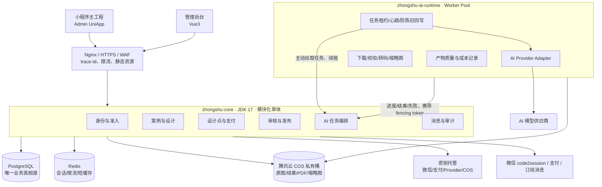
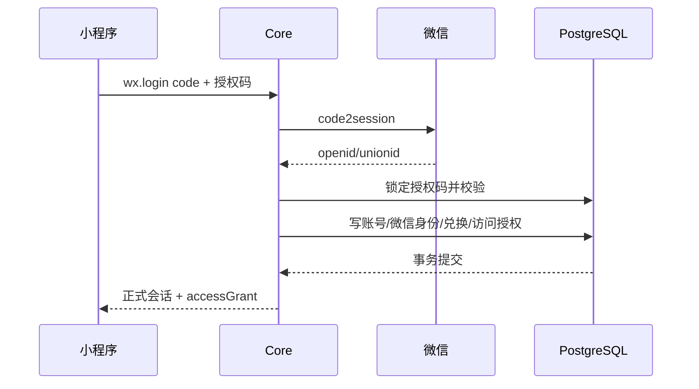
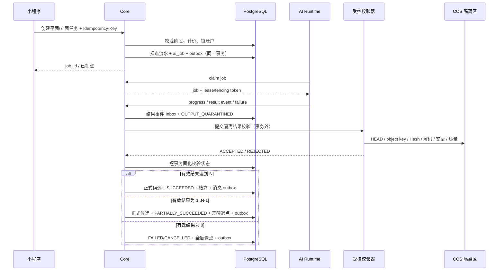
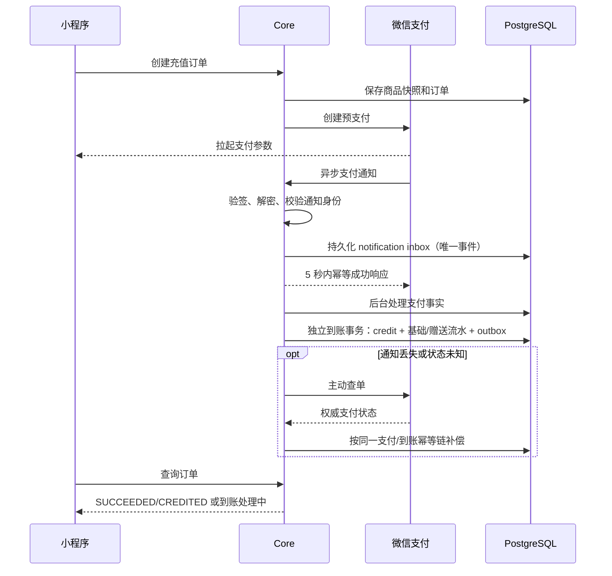
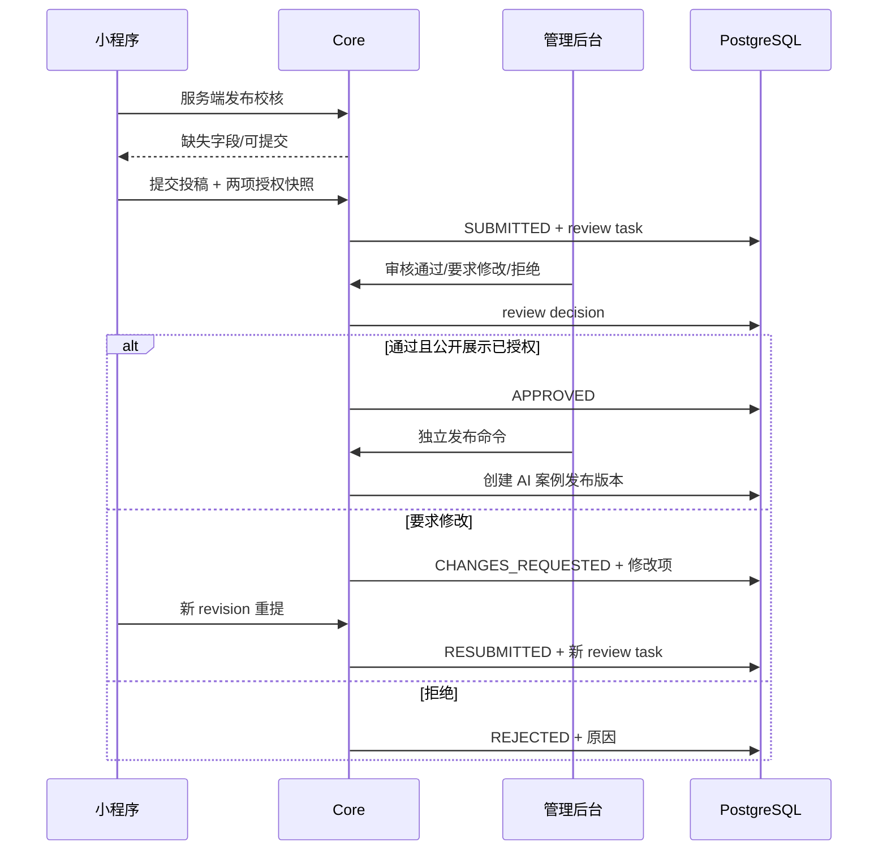

# 众墅之家设计小程序后端技术架构 V1.0

> 文档状态：`PROPOSED`  
> 适用产品：众墅之家设计小程序 V1.2 + 设计管理后台 V1.2  
> 编制日期：2026-09-05  
> 目标：把已确认的页面效果图转化为可开发、可测试、可上线的后端合同。  
> 边界：本文是技术架构与实施基线，不代表代码、真实微信、支付、AI Provider、COS 或生产环境已经验收。

## 1. 结论先行

众墅之家设计小程序不应再建设一套独立业务后端。推荐把它拆成 `zhongshu-ai-platform` 的阶段 3 设计业务与阶段 4 外部集成：平台阶段 0、1A、1B、阶段 2/D-07 和 D-09 通过后，可实施本文的领域合同、数据库、Stub 与自动化验证；D-10 只解锁真实微信/支付，D-11 只解锁真实 AI Provider：

```text
Admin UniApp 小程序 / Vue3 管理后台
                │
                ▼
        zhongshu-core 模块化单体
  身份准入｜案例设计｜积分支付｜审核发布｜消息审计
                │
      PostgreSQL｜Redis｜腾讯云 COS
                │ 内部任务租约 API
                ▼
        zhongshu-ai-runtime
   模型适配｜任务执行｜进度｜质量｜成本｜产物
```

关键决定如下：

1. **一个业务核心**：小程序与管理后台共享账号、案例、设计项目、设计点、订单、审核和资产数据，不做双库同步。
2. **两个部署单元**：`zhongshu-core` 管正式业务事实；`zhongshu-ai-runtime` 只做 AI 计算。P0 不拆更多微服务。
3. **PostgreSQL 是唯一真相源**：余额、订单、任务、审核状态均以数据库为准；Redis 只做会话、限流、短期缓存和锁。
4. **两阶段设计是领域流程**：先平面、选定后再立面；平面任务与立面任务分别计价、扣点、产出候选和选择结果。
5. **任务创建即扣点，按有效结果结算**：0 个有效结果全退，部分结果退缺少槽位，达到请求数全额结算；扣点和退回都只能追加账本流水。
6. **计算、审核、发布是三套状态**：AI 成功不等于投稿审核通过，更不等于公开进入 AI 案例库。
7. **资产默认私有**：原图、平面图、立面图、PDF、缩略图保存在 COS 私有桶；数据库保存对象键、Hash、版本和授权，不保存长期签名 URL。
8. **授权码不是注册密码**：授权码单次兑换并绑定微信身份；后台解绑只撤销访问，不让旧码重新流通。
9. **支付与到账分离**：微信支付订单成功后，由幂等权益发放记录增加“基础设计点”和“赠送设计点”；异常可补偿，不重复到账。
10. **三层门禁不混用**：G0A（平台阶段 0～2、D-07/D-09、输入基线）解锁阶段 3 的领域/Stub；G0B（D-10）解锁真实微信支付；G0C（D-11）解锁真实 AI Provider。任一层未通过都不能冒充相应真实链路已上线。

## 2. 输入依据与当前事实

### 2.1 页面合同

本方案依据 18 张小程序效果图、12 张管理后台效果图、V1.2 产品说明、当前原型代码和甲地灵光参考代码形成。为避免跨工作区绝对路径失效、效果图被替换后方案仍声称“已核对”，全部来源、Git 提交、工作区状态与 SHA-256 固化在 [设计小程序 V1.2 输入基线与追踪](04-设计小程序V1.2输入基线与追踪.md)。

效果图还隐含了四条必须写入后端的规则：

- 生成任务创建成功后扣点，任务最终失败时自动退回。
- 充值基础点与赠送点分开记账。
- “公开展示授权”与“允许作为生成参考”是两项不同授权，后者不能随审核通过自动获得。
- 支付成功与设计点到账是两个可分别查询、分别补偿的事实。

### 2.2 当前实现状态

当前独立原生小程序位于设计交付区的 `前端程序/`。它虽处于 `codex/feat-v12-18-pages` 分支，但当前仍是未接后端的过渡原型：

- `miniprogram/app.json` 只注册 13 个页面，Tab 仍显示“AI户型”，与 18 张 V1.2 页面合同尚未完全一致；
- 业务数据、点数、套餐、进度、用户信息均为硬编码；
- 工程中没有正式 `wx.login`、`wx.request`、`wx.uploadFile` 或统一 API Client；
- V1.2 的 18 张小程序图和 12 张管理后台图目前是设计合同，不是已实现功能。

本平台目录当前状态仍是 `DOCUMENTED`。已确认 JDK 17、RuoYi-Vue-Pro 维护线、Vue3、模块化单体、Flowable、PostgreSQL；尚未迁入代码或初始化数据库。

## 3. 参考甲地灵光：复用模式，不复制历史包袱

参考代码以输入基线中的 `JDLG_ROOT` 指代。

### 3.1 可借鉴的结构与风险经验

| 甲地灵光可借鉴点 | 众墅之家采用方式 |
|---|---|
| `wx.login code → code2session → openid/unionid → 用户` | 保留身份解析流程，增加授权码兑换与服务端组织上下文 |
| AI 任务表、任务编号、进度、成功/失败结果 | 改为 PostgreSQL 任务、租约、尝试和候选结果模型 |
| 模板原图/预览图/水印图和 COS 对象登记 | 扩展为统一 Asset、版权授权、版本、私有下载和水印策略 |
| 订单与灵石流水分离 | 改为充值订单、权益发放、设计点账户和不可变流水 |
| 支付回调验签、订单 claim、补偿扫描 | 只参考结构思想；重新设计通知 Inbox、支付事实、到账事务和主动查单 |
| 用户作品进入后台审核 | 改为投稿、审核结论、公开发布三个独立事实 |
| 任务完成/支付/审核消息 | 使用 Outbox 驱动站内消息和微信订阅消息 |

### 3.2 明确不复制

| 甲地灵光现状 | 不复制原因 | 众墅之家替代方案 |
|---|---|---|
| MySQL 业务真源 | 与平台已确认 PostgreSQL 冲突 | 从首张表开始使用 PostgreSQL |
| Redis 灵石余额 | 容易形成数据库与 Redis 双真源 | 数据库账户行 + 追加式流水；Redis 仅缓存 |
| 进程内 goroutine 每 2 秒轮询 | 单进程故障、扩容和恢复边界不足 | Core 原子租约 + 多实例 Runtime Worker |
| 路由直接调用 model | 业务事务、授权和审计耦合 | Controller → Application Service → Repository |
| 会员、模板解锁、设计师认证语义 | V1.2 已取消会员且业务语义不同 | 只保留设计点、案例与投稿审核 |
| 直接复用支付代码和商户配置 | 商户、回调域名、商品类型和合规未确认 | Payment Port + 众墅配置 + 真实链路门禁 |
| 现有支付到账事务边界 | 部分路径可能先改余额/订单、后写流水，崩溃窗口会造成漏账或重复履约 | 支付事实、到账履约和账本分别幂等，到账在一个数据库事务内完成 |

## 4. 页面到后端能力映射

### 4.1 小程序 18 个页面

| 页面 | 读取能力 | 写入/动作 | 主要后端模块 |
|---|---|---|---|
| 01 首页 | 首页聚合、精选案例、未读数 | 进入设计/预算/案例 | 聚合查询、案例、消息 |
| 02 户型库 | 公司/AI 来源、风格、层数、面积排序、分页 | 搜索、筛选、收藏 | 案例库、收藏、资产 |
| 03 户型详情 | 结构化参数、封面、各层平面、立面、来源 | 收藏、以此设计 | 案例库、设计项目 |
| 04 户型设计 | 参考案例、计价规则、余额、数量选项 | 建项目、创建平面任务 | 设计、AI 编排、设计点 |
| 05 自主设计 | 计价规则、上传限制 | 上传草图、建项目、创建平面任务 | 资产、设计、AI 编排、设计点 |
| 06 平面生成中 | 任务状态、进度、阶段、预计完成 | 后台继续、请求取消 | AI 任务、消息 |
| 07 选择平面 | 候选平面、参数、扣点结果 | 选定、重新生成 | 候选版本、选择、AI 任务 |
| 08 立面设置 | 已选平面、风格/屋顶/材质/颜色配置、余额 | 创建立面任务 | 设计、AI 编排、设计点 |
| 09 立面生成中 | 任务状态、进度 | 后台继续、请求取消 | AI 任务、消息 |
| 10 选择立面 | 候选立面、与平面关系 | 选定、重新生成、完成方案 | 候选版本、选择 |
| 11 最终结果 | 最终立面、各层平面、参数、文件 | 调整、预算、下载、投稿 | 设计版本、资产、预算、投稿 |
| 12 发布校核 | 服务端校核结果、缺失字段、授权状态 | 补充字段、提交审核 | 投稿、授权、审核 |
| 13 预算输入 | 已选方案参数、地区/标准选项 | 创建预算测算 | 预算 |
| 14 预算结果 | 规则版本、费用构成、总价区间 | 保存预算 | 预算、设计项目 |
| 15 我的 | 微信身份、授权状态、余额、设计/发布统计 | 打开记录/充值/设置/客服 | 身份、设计点、查询聚合 |
| 16 授权码验证 | 当前绑定状态 | 兑换授权码并绑定微信 | 微信身份、授权码 |
| 17 设计点充值 | 已启用方案、基础/赠送/合计 | 创建订单、拉起支付 | 商品配置、支付 |
| 18 支付成功 | 订单金额、支付状态、到账拆分 | 查询到账、返回设计 | 支付、权益发放、设计点 |

### 4.2 管理后台 12 个页面

| 页面组 | 后端能力 | 权限建议 |
|---|---|---|
| 登录/工作台 | 管理员认证、待办、今日任务/审核/订单/点数聚合 | `dashboard.read` |
| 户型库管理 | 公司/AI 案例查询、草稿、编辑、上下架、版本 | `case.read/write/publish` |
| 新增公司案例 | 参数校核、封面/平面/立面/PDF 上传、预览、发布 | `case.create/publish` |
| AI 案例审核 | 投稿队列、详情、补充退回、通过、上架 | `submission.review`；审核人与投稿人分离 |
| 授权码管理 | 批量生成、一次性导出、停用、撤销绑定、查看审计 | `access-code.manage/export` |
| 充值方案 | 金额、基础点、赠送点、推荐、顺序、启停和版本 | `recharge-plan.manage` |
| 充值订单 | 支付事实、到账事实、异常订单、补偿处理 | `payment.read/reconcile` |
| 设计点流水 | 充值、赠送、生成扣点、失败退回、人工调整、导出 | `points.read/adjust/export` |

后台展示菜单不能作为授权。所有权限必须由服务端按资源、动作、对象归属和字段级策略再次判断。

## 5. 目标技术架构



### 5.1 技术栈建议

| 层 | 选型 | 说明 |
|---|---|---|
| 业务核心 | JDK 17 + RuoYi-Vue-Pro JDK 17 维护线 + Spring Boot | 延续已确认底座；固定上游精确 SHA 后迁入 |
| 数据访问 | MyBatis / MyBatis-Plus | 复用底座，但所有 SQL 必须在真实 PostgreSQL 验证 |
| 管理后台 | `yudao-ui-admin-vue3` | 只建设一套后台，不保留平行 Vue2/Vben 真源 |
| 小程序 | `yudao-ui-admin-uniapp` / Admin UniApp | 遵守已确认 D-04；现有原生小程序只作视觉、交互与页面合同参考 |
| 数据库 | PostgreSQL 17 优先，16 可接受 | 唯一关系数据库；生产版本实施前核验 |
| 数据迁移 | 推荐 Flyway + 明确回滚脚本/备份门禁 | PEND-005 正式冻结后执行；禁止手工改库无脚本 |
| Redis | 会话、验证码、限流、短缓存、分布式互斥 | 不保存权威余额、订单或任务终态 |
| 流程 | Flowable | 只承载审核人、待办、流转；领域表保存正式状态 |
| 对象存储 | 腾讯云 COS 私有桶 + 短时签名/STS | 数据库保存 object key，不保存长期签名 URL |
| AI Runtime | D-11 冻结后再选实现语言；候选为 Go Worker | D-11 前只固定内部合同；若选 Go，也只复用经审计的 Provider/媒体处理模式 |
| API | REST + OpenAPI 3 | 复用 RuoYi 的 `/app-api`、`/admin-api` 与 `CommonResult<T>`；Runtime 使用独立内部前缀 |
| 可靠事件 | PostgreSQL Outbox + Worker claim | P0 不引入 Kafka/RabbitMQ；出现真实吞吐信号后再替换适配器 |

### 5.2 仅两个部署单元

#### `zhongshu-core`

负责：

- 账号、微信身份、授权码、会话和服务端组织上下文；
- 案例、设计项目、阶段输入、候选、选择和最终版本；
- 计价、设计点账户/流水、充值订单、权益到账；
- 投稿、审核、公开发布与撤回；
- 预算规则和测算快照；
- 文件元数据、下载授权、消息、审计；
- AI 任务创建、租约、结果隔离校验、终态结算和差额/全额退点。

#### `zhongshu-ai-runtime`

负责：

- 调用平面/立面 AI Provider；
- Provider 请求、轮询、取消、超时和有限重试；
- 产物下载、格式/尺寸/完整性检查、缩略图与上传；
- 记录 Provider task id、尝试、原始错误、成本和质量信息；
- 使用 Core 发放的任务租约和受限资产凭证回写进度/结果。

禁止：扣设计点、审批投稿、公开案例、决定用户权限或直接修改业务账户。

## 6. 逻辑模块与代码边界

为避免过度拆分，P0 建议只建立四个自研 Maven 业务模块，内部再按领域包拆分；System、Infra、BPM 复用底座模块。

| Maven 模块 | 领域包 | 职责 |
|---|---|---|
| `zhongshu-module-identity` | `account`, `wechat`, `accesscode`, `session`, `profile`, `privacy` | 微信登录、账号映射、授权码、访问授权、用户偏好、隐私请求与服务端上下文 |
| `zhongshu-module-design` | `catalog`, `project`, `candidate`, `asset`, `rights`, `budget`, `submission`, `review` | 案例库、两阶段设计、资产授权、结果版本、预算、投稿审核 |
| `zhongshu-module-commerce` | `pricing`, `points`, `recharge`, `payment` | 计价快照、设计点账本、充值商品、订单、到账和对账 |
| `zhongshu-module-ai-orchestration` | `job`, `lease`, `attempt`, `callback`, `settlement` | AI 任务准入、租约、状态机、Runtime 合同、结果结算 |
| 底座 Infra 扩展（非新业务模块） | `reliableevent`, `audit`, `export`, `ticket` | 通用 Outbox/dispatcher、审计、异步导出和一次性交付/下载票据 |

跨模块只通过 Application Service/领域事件调用，不允许 Controller 直接写其他模块的 Mapper。各业务模块依赖 Infra 的 `ReliableEventPort`/`AuditPort`/`DeliveryPort`，不得为写 Outbox 反向依赖 AI 编排模块。

### 6.1 身份与授权码

核心对象：

- `account`：全局用户账号；
- `wechat_identity`：`appid + openid` 唯一，`unionid` 可选；
- `design_access_code_batch`：批次、数量、发行方、有效期、`delivery_mode=INLINE/TICKET`、交付状态与 `secret_exposed_at`；
- `design_access_code`：授权码 HMAC 摘要、pepper 版本、掩码前缀、批次、有效期、状态、用途备注；
- `design_access_grant`：某账号获得的小程序使用权；
- `access_code_redemption`：兑换事实和审计；
- `user_session`：刷新 token Hash、设备摘要、过期和吊销状态。

推荐默认规则：

1. 客户端提交临时 `wx.login code`，不得提交自称的 openid。
2. 服务端调用 `code2session`，以 `appid + openid` 查找微信身份。
3. 未获准用户得到受限会话，只允许查询准入状态和兑换授权码。
4. 兑换时锁定授权码记录，校验启用、有效期、未消费和绑定限制。
5. 同一事务写兑换事实、访问授权和授权码 `CONSUMED` 状态。
6. 后台“解绑”只撤销 `design_access_grant`；原授权码仍保持已消费，需要重新发新码。
7. 每个授权码使用密码学安全随机源生成，随机熵至少 128 bit；数据库保存带服务端 pepper 的 HMAC-SHA-256 摘要和 pepper 版本，pepper 由密钥托管并支持轮换，禁止对低熵短码只做普通 Hash。
8. 批次创建时固定 `deliveryMode=INLINE` 或 `TICKET`，两种方式互斥。任一完整码第一次交付时写 `secretExposedAt`；之后不得重建明文或再生成票据，只能废弃该批次并创建新批次。
9. `TICKET` 模式把明文仅写入加密的短期私有制品；兑换票据时先原子标记已消费再输出，传输中断也不可重放。列表、日志、审计正文和普通导出始终只显示掩码。

### 6.2 案例库与收藏

核心对象：

- `design_case`：稳定案例 ID、来源 `COMPANY/AI`、当前发布版本和发布状态；
- `design_case_version`：名称、说明、风格、层数、面积、面宽、进深、房厅卫、标签和乐观锁版本；
- `design_case_asset`：封面、各层平面、立面、PDF 等资产关系；
- `case_favorite`：用户收藏，`user_id + case_id` 唯一；
- `case_publication`：上架、下架、时间、操作者与原因。

列表只返回 `PUBLISHED` 案例。AI 案例必须同时满足审核通过和发布生效。默认排序使用 `building_area ASC, id ASC`，游标中同时包含面积与 ID，避免同面积分页重复。

建议索引：

```text
(publication_status, source_type, style_code, floor_bucket, building_area, id)
(owner_user_id, created_at desc, id desc)
(review_status, submitted_at, id)
```

### 6.3 设计项目与两阶段结果

核心对象：

- `design_project`：用户的一次完整设计，来源为参考案例或自主设计；
- `design_requirement_snapshot`：宅基地、层数、家庭需求、提示词、上传草图及输入版本；
- `design_candidate`：某任务生成的单个平面或立面候选；
- `design_selection`：某阶段当前被选中的候选；
- `design_result_version`：最终平面组合、立面、说明和来源关系的不可变版本；许可由 `asset_rights_grant` 单独管理。

约束：

- 未选定平面候选，不得创建立面任务；
- 立面任务必须引用平面 `candidate_id` 和其资产 Hash；
- 重新生成创建新任务和新候选，不覆盖旧结果；
- 修改会生成新的 `design_result_version`，旧版本只读；
- 最终页展示的平面与立面必须属于同一项目且满足阶段关系。

### 6.4 AI 任务与多实例 Worker

核心对象：

- `ai_job`：用户可见任务、阶段、数量、报价快照、状态、单调 `decision_seq` 和取消请求；
- `ai_job_attempt`：Provider、请求 ID、尝试次数、租约、开始/结束、成本和错误；
- `ai_result_event_inbox`：`provider_code + source_event_id`、Runtime 结果事件、Core `received_seq`/接收时间、事件 Hash、attempt/租约校验和处理状态；
- `ai_job_result`：候选槽位号、attempt、Provider 输出 ID/内容 Hash、隔离资产、校验状态、质量状态和元数据；
- `ai_job_settlement`：请求数量、有效计费数量、原扣点、应结算点数、累计退款和结算版本；
- `outbox_event` 由通用 Infra 提供，AI 编排只通过 `ReliableEventPort` 写任务、结算和消息事件。

任务状态：

```text
CREATED → QUEUED → RUNNING → VALIDATING → SETTLING
    │        │         │           │           ├→ SUCCEEDED
    └────────┴─────────┴───────────┴───────────├→ PARTIALLY_SUCCEEDED
             │         │           │           ├→ FAILED
             └→ CANCELLED           └→ CANCEL_REQUESTED → SETTLING → CANCELLED/PARTIALLY_SUCCEEDED/SUCCEEDED

结果：RECEIVED → OUTPUT_QUARANTINED → VALIDATING → ACCEPTED / REJECTED
```

实现规则：

- 创建 API 必须带 `Idempotency-Key`；同用户、同 Key、同请求体返回同一任务。
- Core 在事务中完成：服务端计价 → 锁点数账户 → 写扣点流水 → 创建任务 → 写 Outbox。
- Worker 通过内部 claim API 领取任务；Core 使用 `FOR UPDATE SKIP LOCKED`、租约过期时间和递增 fencing token 原子发放。
- 进度/成功/失败回调必须携带 `job_id + attempt_no + fencing_token`；旧 Worker 的陈旧回写被拒绝。
- 租约超时后允许重新领取；Provider 请求必须使用稳定业务幂等键，避免重复生成/计费。
- `fencing_token` 只验证回写者是否仍持有租约，不参与业务结果去重。Inbox 以 `(provider_code, source_event_id)` 唯一；Provider 没有事件 ID 时，Adapter 必须由稳定 Provider request ID、事件类型和原始事件 Hash 合成确定性 ID。拒绝事件可以按 attempt 共存，不得占死候选槽位。
- 仅对 `validation_state='ACCEPTED'` 的正式候选建立 `(job_id, candidate_slot_no)` 部分唯一约束；另对非空 `(provider_code, provider_output_id)` 和任务内 `(job_id, content_hash)` 去重。旧 attempt 的 `REJECTED` 结果不阻止新 attempt 填充同一槽位。
- Runtime 回写先进入 `ai_result_event_inbox` 和隔离前缀。Core 受控校验器在数据库事务外执行 COS HEAD、object key/Hash、格式、解码资源、内容安全和质量检查，再用短事务把结果推进为 `ACCEPTED/REJECTED`；不得信任 Runtime 自报“有效”。
- 达到 N 个 `ACCEPTED`、Provider 宣告结束、取消宽限到期或结果接收期限到期后，结算器才进入 `SETTLING`。正式候选可见、任务终态、结算、差额退款和 Outbox 在同一事务提交；扫描/外部调用不进入该事务。
- 计费采用按有效结果槽位结算：请求 N 个，最多接收 N 个通过格式、完整性、去重和质量底线的结果；有效 0 个为 `FAILED` 并全退，1～N-1 个为 `PARTIALLY_SUCCEEDED` 并退缺少槽位，达到 N 个为 `SUCCEEDED`。N+1 及以上不多收用户点数。
- 差额退款金额为 `(requested_count - accepted_billable_count) × unit_point_cost`。每次结算有唯一 `settlement_version`，累计退款不得超过原扣款；技术重试和重复回调不得新增结算。
- `CREATED/QUEUED` 尚未被领取时可直接取消，结算 0 个结果并全退。`RUNNING/VALIDATING` 取消时，Core 用短事务锁同一 job 行，递增 `decision_seq` 并保存权威 `cancel_seq`/`cancel_requested_at`，进入 `CANCEL_REQUESTED`；提交后才请求 Provider 尽力取消。
- 每个结果事件接收也用短事务锁同一 job 行，递增 `decision_seq` 并保存 `received_seq`，然后写 Inbox。取消与结果并发只以该单调序号裁决：尚无 `cancel_seq` 或 `received_seq < cancel_seq` 的事件可继续校验并参与结算；`received_seq > cancel_seq` 的事件只存诊断。时间戳只用于审计，不承担顺序判断。若终态 CAS 先成功，后到取消返回状态冲突。
- `CANCEL_REQUESTED` 在既有合格结果校验完成或取消宽限到期后按有效槽位结算；终态一经提交不可改，任何迟到结果只留诊断。不得只凭客户端离开页面退款。

### 6.5 设计点与计价

核心对象：

- `design_point_account`：`available_points`、`reserved_points`、版本号；每个用户一个主账户，总余额定义为两者之和；
- `design_point_ledger`：只追加，不更新历史；
- `generation_price_rule`：阶段、单个价格、允许数量、有效期、版本；
- `ai_task_charge`：任务、价格规则版本、单价、数量、总价与扣款流水关系；
- `manual_point_adjustment`：人工调整申请、原因、操作者和审核信息。

流水类型最少包含：

```text
RECHARGE_BASE_CREDIT
RECHARGE_BONUS_CREDIT
FLAT_GENERATION_DEBIT
ELEVATION_GENERATION_DEBIT
TASK_SETTLEMENT_REFUND
MANUAL_CREDIT
MANUAL_DEBIT
```

每条流水记录：`biz_type`、`biz_id`、变化值、变化前/后总余额、幂等键、操作者、原因、时间。任务扣点只扣可用点；退款预留仅在账户内把可用点转为预留点、不先写冲正流水，总余额不变；渠道成功后再减少预留点并写冲正流水。账户与流水由同一数据库事务更新，Redis 不参与最终判定。

人工调点必须走制单复核，不能让一个账号既申请又生效：

```text
DRAFT → SUBMITTED → APPROVED → EXECUTED
                  └→ REJECTED
```

- `maker_user_id != checker_user_id`；生产环境所有人工增减点都适用，不因金额小而绕过。
- 复核通过后，用 `adjustment_id` 作为执行幂等键，在一个事务中写调整单终态、账本流水、账户余额和审计事件。
- 已执行记录只能用反向调整单纠正，禁止修改或删除原流水。

### 6.6 充值与支付

核心对象：

- `recharge_plan` 与版本快照；
- `recharge_order`：金额、渠道、商品快照、`payment_state` 与 `fulfillment_state`；
- `payment_notification_inbox`：渠道事件 ID、验签所需请求头、加密通知体、内容 Hash、解密后的最小规范化载荷、验证/处理状态和重试次数；敏感载荷加密保存并按周期清理；
- `payment_transaction`：商户、渠道交易号、支付金额、支付时间和查询来源；
- `recharge_credit`：一次订单对应的一次权益发放事实，`order_id` 唯一；
- `refund_order` / `refund_transaction`：渠道退款申请、实付金额快照、渠道退款事实和各自状态；
- `point_refund_reservation`：发起退款时冻结待回收的基础点与赠送点；
- `point_reversal`：渠道退款成功后的点数冲正，不删除原流水。

支付事实状态与到账履约状态必须分开：

```text
PaymentState:
CREATED → PENDING → SUCCEEDED
    ├────→ CLOSED
    ├────→ FAILED
    └────→ UNKNOWN（主动查单后再归并）

FulfillmentState:
NOT_READY → PENDING → CREDITED
                 └→ FAILED → PENDING（补偿）

ChannelRefundState（独立于 PaymentState）:
CREATED → PROCESSING → SUCCEEDED
                    ├→ UNKNOWN → PROCESSING（主动查单）
                    └→ FAILED

PointReversalState:
NOT_RESERVED → RESERVED → PENDING → REVERSED
                         ├→ FAILED → PENDING（补偿）
                         └→ RELEASED（渠道明确失败）
```

实现规则：

- 创建订单时冻结充值方案快照，后台后来改价不影响历史订单。
- D-10 确认前只实现通道无关 `PaymentPort` 和 Stub，不冻结微信预下单参数、渠道状态或虚拟商品售后规则。
- 渠道通知入口先验签/解密并持久化 Inbox，再快速应答；到账等业务逻辑由可靠后台处理，避免回调超时。微信支付候选 adapter 应使用官方 API v3 SDK。
- `payment_notification_inbox` 对 `(channel, event_id)` 唯一；`payment_transaction` 对 `(channel, merchant_id, transaction_id)` 唯一。重复、乱序通知可重入但不能重复改变支付事实。
- 支付事实事务只负责校验商户、AppID、金额、订单、渠道状态并推进 `payment_state`；不得在未确认支付时写设计点。
- 到账事务锁定订单并通过状态 CAS，原子写 `recharge_credit(order_id)`、基础点流水、赠送点流水、账户余额、`fulfillment_state=CREDITED` 和 Outbox。
- 小程序支付成功页必须查询服务端订单，不信任页面 URL 参数。
- 对本地 `PENDING/UNKNOWN` 且超过阈值的订单主动调用渠道查单，不能只等待可能丢失的回调；对 `SUCCEEDED + PENDING/FAILED` 的到账状态执行带租约补偿，超过次数进入死信和人工处置。
- P0 现金售后只支持“整单全额退款”，不开放部分现金退款：订单到账后若出现任一设计点扣减流水，或当前可用余额不足该订单发放的“基础点 + 赠送点”，退款申请直接拒绝，不形成负余额或用户债务。该保守规则必须在 D-10 签字；未来要支持部分退款，需新增版本化分摊算法和迁移，不能复用 P0 状态偷偷放开。
- 受理退款的数据库事务锁定订单与点数账户，校验无活动退款、无到账后消费且余额充足，创建 `refund_order`，并把该订单全部基础点/赠送点从可用余额转为 `RESERVED`；此时尚不写冲正流水。
- 渠道退款调用必须在数据库事务外。渠道明确失败则事务性释放预留；状态未知保持预留并主动查单；渠道成功后，独立重试事务把预留转换为两条冲正流水、减少账户总余额并推进 `PointReversalState=REVERSED`。若渠道成功后本地事务失败，预留继续阻止消费，补偿 Worker 重试并可进入死信人工处置。
- 每个退款申请使用稳定 `refund_request_key`；渠道退款号唯一。锁订单后校验：累计 `SUCCEEDED` 渠道退款金额不得超过原实付金额，累计基础点/赠送点冲正分别不得超过原发放值；原支付、到账和流水永不删除。
- 真实微信、虚拟商品支付方式、退款细则和 iOS 场景必须等 D-10 与当前渠道规则确认后实施。

### 6.7 投稿、审核与发布授权

三类状态必须分开：

```text
计算：QUEUED → RUNNING → SUCCEEDED/FAILED/CANCELLED
投稿：DRAFT → VALIDATED → SUBMITTED → IN_REVIEW
                         ├→ CHANGES_REQUESTED → RESUBMITTED → IN_REVIEW
                         ├→ APPROVED
                         └→ REJECTED
发布：PRIVATE → PUBLISH_PENDING → PUBLISHED → WITHDRAWN
```

核心对象：

- `case_submission`：投稿快照、提交人、服务端校核结果、当前审核轮次；
- `submission_revision`：每次提交/重提的不可变内容与授权快照；
- `review_task`：审核轮次、审核人、状态、期限；
- `review_decision`：通过、要求修改或拒绝，保存意见和校核快照；
- `asset_rights_grant`：唯一授权真源，按用途分别记录公开展示与生成参考许可；
- `case_publication`：正式上架/下架事实。

用户在提交时授予明确范围的许可；平台审核只决定内容是否符合上架条件，不能替用户扩大授权。审核通过后仍需单独执行发布动作；只有当前有效的 `GENERATION_REFERENCE` 授权覆盖该版本、地域和用途时，新 AI 任务才可引用。

`WITHDRAWN` 的发布事实不可改回 `PUBLISHED`。需要重新上架时，必须创建新的案例版本、取得当前有效公开许可并生成新的 `case_publication`，再走 `PUBLISH_PENDING → PUBLISHED`。

### 6.8 预算

核心对象：

- `budget_rule_version`：地区、结构、材料等级、单方区间、费用构成、生效期；
- `budget_estimate`：输入快照、规则版本、结果区间、费用明细和免责声明；
- 与 `design_project` / `design_result_version` 关联。

预算结果必须可复算：保存规则版本和输入快照，规则更新不得修改历史预算。P0 只做参考区间，不进入正式报价、合同或工程结算。

### 6.9 资产中心

`asset` 至少包含：

```text
asset_id, tenant_org_id, owner_user_id, object_key, sha256,
mime_type, size_bytes, width, height, page_count,
asset_type, source_type, parent_asset_id,
provenance_type, provenance_ref, moderation_status,
security_scan_status, created_at
```

配套对象包括 `asset_upload_ticket`、`asset_scan_result` 与 `one_time_download_ticket`；票据只保存 Hash/状态/过期时间，不保存可反复取回的完整秘密。

授权不在 `asset` 上保存重复布尔值，统一由版本化 `asset_rights_grant` 判定：

```text
grant_id, asset_id/result_version_id, grantor_user_id, rights_holder,
scope(PUBLIC_DISPLAY/GENERATION_REFERENCE), territories, purposes,
proof_asset_id, effective_at, expires_at, status, withdrawn_at,
rights_version, parent_grant_id, created_at
```

规则：

- 客户端先申请上传凭证，再直传私有 COS；完成后由服务端校验 object key、大小、声明 MIME、魔数、Hash、像素/页数和图片/PDF 结构。
- 用户草图只接受 JPG/PNG，单文件上限 10MB；后台公司案例接受 JPG/PNG/PDF，单文件上限 20MB。两组限制均由服务端按 `asset_type` 配置并强制执行。
- 图片入库前移除 EXIF/GPS；PDF/图片设置像素、页数、解压后大小和解析耗时上限，隔离恶意文件与解压炸弹。
- 资产必须记录权利人、来源、用途、地域、证明、有效期和衍生链；内容安全审核与版权授权是两个独立状态。
- 下载前执行对象级权限，返回短期签名 URL；批量下载、原图下载和导出写审计。
- AI Runtime 只可写指定任务前缀，不能浏览整个桶。
- 创建平面任务时锁定所引用的 `design_case_version`，在事务内校验当前有效的 `GENERATION_REFERENCE` 授权，并把 `grant_id + rights_version` 快照写入任务；仅获公开展示许可的案例可以浏览，但不能用于生成。
- 生成参考授权撤回/到期后立即阻止新任务引用；公开展示授权撤回成功后，权威列表、详情和下载立即拒绝该版本。CDN 清理、投诉处置、证据保全和衍生资产排查可异步执行；已经被 Core 接受且正在执行的任务保留授权快照和审计，不追溯篡改历史产物。

### 6.10 消息与审计

站内消息类型至少包含：任务完成/失败、退款、投稿通过/退回、支付到账异常、授权失效。

核心对象包括 `user_message`、`message_receipt`、`export_job`、`one_time_delivery_ticket` 和 `audit_event`。后台批量导出与授权码交付不得在同步请求里拼大文件；创建异步 job，生成短时单次票据，并记录申请人、过滤条件、字段范围、文件 Hash、下载人和过期时间。

`outbox_event` 与业务事务同时提交，由独立 dispatcher 投递站内消息和微信订阅消息。通知失败不回滚已经完成的业务事务，但必须重试并可人工查询。

P0 冻结顶部铃铛为唯一消息入口，点击进入同一个消息中心；“我的”不再放第二个消息入口。后端只提供一套未读数、消息列表和已读合同，避免形成两套导航/状态语义。

### 6.11 隐私、数据生命周期与客服入口

核心对象：

- `privacy_policy_version` / `privacy_consent`：隐私政策、用户协议、AI 第三方处理告知的版本与同意事实；
- `data_subject_request`：数据导出、更正、删除、账号关闭的申请、校验、执行和留存依据；
- `retention_policy`：草稿、上传原图、AI 输入输出、日志、订单和账本的保留周期；
- `support_entry_config`：客服电话、企业微信或帮助页等可配置入口，P0 不扩展为完整工单系统。

实现规则：

- 首次登录记录协议版本；把用户资产发送给第三方 AI Provider 前，必须具备当前有效的处理告知与必要同意，并按最小必要原则传输。
- 账号关闭后先吊销会话与访问授权，再按数据类别删除、匿名化或依法保留；支付、账本和审计数据不得假删除成“看似不存在”。
- 数据导出使用异步任务和一次性短期下载票据，完成、失败与过期均可查询并写审计。
- 日志、埋点和 Provider 请求不得携带不必要的 openid、授权码、精确地址、EXIF 或长期下载 URL。

## 7. API 合同建议

### 7.1 统一规范

- 前缀：小程序 `/app-api/design/v1`，后台 `/admin-api/design/v1`，AI Runtime `/internal-api/design/v1`，与已确认 RuoYi 底座分面一致。
- JSON 字段统一 `camelCase`；时间统一 ISO 8601 UTC，展示端转换时区。
- 复用底座 `CommonResult<T>`：`{ "code": 0, "msg": "", "data": ... }`；列表的 `data` 使用 `PageResult<T>`，不再自创第二套响应壳。
- 业务错误使用稳定数值 `code` + 用户可读 `msg`；`traceId` 放响应头和受控日志，字段校验明细放 `data.details`。HTTP 层仍正确区分鉴权、限流与服务异常。
- POST 创建任务/订单/投稿必须支持 `Idempotency-Key`。
- 同一主体与 Key 的请求体 Hash 相同则返回原结果；Hash 不同返回 `IDEMPOTENCY_KEY_REUSED`，禁止静默复用。
- 小程序案例/消息采用游标分页；后台管理列表采用页码分页。
- 后台编辑返回 `version`/ETag，过期版本更新返回 `STATE_VERSION_CONFLICT`。
- 业务对象返回 `allowedActions`，客户端不自行推导权限。

### 7.2 小程序核心 API

```text
POST /app-api/design/v1/auth/wechat-login
GET  /app-api/design/v1/access-grant
POST /app-api/design/v1/access-code-redemptions

GET  /app-api/design/v1/home
GET  /app-api/design/v1/cases
GET  /app-api/design/v1/cases/{caseId}
PUT  /app-api/design/v1/cases/{caseId}/favorite
DELETE /app-api/design/v1/cases/{caseId}/favorite
GET  /app-api/design/v1/favorites

POST /app-api/design/v1/assets/upload-tickets
POST /app-api/design/v1/assets/{assetId}/complete
POST /app-api/design/v1/assets/{assetId}/download-tickets

POST /app-api/design/v1/design-projects
GET  /app-api/design/v1/design-projects
GET  /app-api/design/v1/design-projects/{projectId}
GET  /app-api/design/v1/design-projects/{projectId}/result-versions
POST /app-api/design/v1/design-projects/{projectId}/revision-requests
POST /app-api/design/v1/design-projects/{projectId}/flat-jobs
POST /app-api/design/v1/design-projects/{projectId}/flat-selections
POST /app-api/design/v1/design-projects/{projectId}/elevation-jobs
POST /app-api/design/v1/design-projects/{projectId}/elevation-selections
GET  /app-api/design/v1/ai-jobs/{jobId}
POST /app-api/design/v1/ai-jobs/{jobId}/cancellation-requests

POST /app-api/design/v1/design-projects/{projectId}/publication-validations
POST /app-api/design/v1/design-projects/{projectId}/submissions
GET  /app-api/design/v1/submissions
GET  /app-api/design/v1/submissions/{submissionId}
POST /app-api/design/v1/submissions/{submissionId}/resubmissions
POST /app-api/design/v1/design-projects/{projectId}/budget-estimates
GET  /app-api/design/v1/design-projects/{projectId}/budget-estimates
GET  /app-api/design/v1/budget-estimates/{estimateId}

GET  /app-api/design/v1/point-account
GET  /app-api/design/v1/point-ledger
GET  /app-api/design/v1/recharge-plans
POST /app-api/design/v1/recharge-orders
GET  /app-api/design/v1/recharge-orders
GET  /app-api/design/v1/recharge-orders/{orderId}

GET  /app-api/design/v1/messages
GET  /app-api/design/v1/messages/unread-count
POST /app-api/design/v1/messages/{messageId}/read-receipts
GET  /app-api/design/v1/profile
PATCH /app-api/design/v1/profile/preferences
GET  /app-api/design/v1/privacy-consents
POST /app-api/design/v1/privacy-consents
POST /app-api/design/v1/data-export-requests
GET  /app-api/design/v1/data-export-requests/{requestId}
POST /app-api/design/v1/account-closure-requests
GET  /app-api/design/v1/account-closure-requests/{requestId}
GET  /app-api/design/v1/support-entry
```

### 7.3 管理后台核心 API

```text
GET  /admin-api/design/v1/dashboard/summary

GET/POST/PATCH /admin-api/design/v1/cases
POST /admin-api/design/v1/cases/{caseId}/publications
POST /admin-api/design/v1/cases/{caseId}/withdrawals
POST /admin-api/design/v1/cases/bulk-actions

GET  /admin-api/design/v1/submissions
GET  /admin-api/design/v1/submissions/{submissionId}
POST /admin-api/design/v1/submissions/{submissionId}/review-decisions
POST /admin-api/design/v1/submissions/bulk-review-commands

GET/PATCH /admin-api/design/v1/access-codes
POST /admin-api/design/v1/access-code-batches
POST /admin-api/design/v1/access-code-batches/{batchId}/delivery-tickets
POST /admin-api/design/v1/access-grants/{grantId}/revocations

GET/POST/PATCH /admin-api/design/v1/recharge-plans
GET  /admin-api/design/v1/recharge-orders
POST /admin-api/design/v1/recharge-orders/{orderId}/refund-requests
GET  /admin-api/design/v1/refund-orders
GET  /admin-api/design/v1/refund-orders/{refundOrderId}
POST /admin-api/design/v1/recharge-orders/{orderId}/reconciliation-actions
GET  /admin-api/design/v1/point-ledger
POST /admin-api/design/v1/manual-point-adjustments
POST /admin-api/design/v1/manual-point-adjustments/{adjustmentId}/review-decisions

GET  /admin-api/design/v1/ai-jobs
GET  /admin-api/design/v1/ai-jobs/{jobId}
POST /admin-api/design/v1/export-jobs
GET  /admin-api/design/v1/export-jobs/{exportJobId}
POST /admin-api/design/v1/export-jobs/{exportJobId}/download-tickets
GET  /admin-api/design/v1/audit-events
```

授权码批次在创建时固定完整码的交付方式：创建响应 `INLINE` 或一次性交付票据 `TICKET`，二者互斥。票据短时有效、单次消费、下载留审计；一旦 `secretExposedAt` 有值就不能再次生成明文或票据。列表、搜索、日志和普通导出永远只返回掩码。

### 7.4 AI Runtime 内部 API

```text
POST /internal-api/design/v1/ai-jobs/claims
POST /internal-api/design/v1/ai-jobs/{jobId}/lease-renewals
POST /internal-api/design/v1/ai-jobs/{jobId}/progress-events
POST /internal-api/design/v1/ai-jobs/{jobId}/result-events
POST /internal-api/design/v1/ai-jobs/{jobId}/failure-events
```

内部接口使用独立服务身份、mTLS/签名、时间戳和重放窗口；Runtime 只提交事实候选，Core 验证租约、结果幂等、资产前缀和状态迁移后才落正式业务状态。

### 7.5 页面按钮、状态与权限闭环

| 页面动作 | API/命令 | 成功后端状态 | 空/错/权限边界 |
|---|---|---|---|
| 首页/户型库筛选 | `GET cases` | 无写状态 | 无数据返回空页；未授权只看准入页；过滤参数服务端白名单 |
| “以此设计” | `POST design-projects` | `DRAFT` | 案例可见不代表可作生成参考；创建任务时再验授权 |
| “开始生成” | `POST flat-jobs/elevation-jobs` | `QUEUED` + 已扣点 | 余额不足、阶段冲突、价格变更可重试；重复 Key 返回原任务 |
| “选定方案” | `POST *-selections` | 当前选择版本递增 | 候选不属本人/项目、任务未终态、版本冲突拒绝 |
| “下载” | `POST download-tickets` | 一次性短期票据 | 无权、资产隔离、扫描未通过或票据过期拒绝 |
| “提交发布” | 校核 + `POST submissions` | `SUBMITTED` | 校核失败返回字段明细；用户授予许可但不能自批通过 |
| “修改后重提” | `POST resubmissions` | `RESUBMITTED` | 仅 `CHANGES_REQUESTED` 可用；新建 revision，不覆盖旧提交 |
| “充值/支付成功” | 创建/查询订单 | `PENDING` 或 `SUCCEEDED+CREDITED` | 客户端成功页不是到账证据；显示“到账处理中”并可刷新 |
| 我的→记录 | 项目/收藏/投稿/订单列表 | 无写状态 | 分页、对象级授权；各列表独立空态和失败重试 |
| 后台审核/批量审核 | review command | 审核决定落库；发布另操作 | 审核自己作品拒绝；批量逐项返回成功/失败，不静默半成功 |
| 后台调点 | adjustment + review | `EXECUTED` + 流水 | 制单人与复核人必须不同；不能直接改余额 |
| 后台导出/发码 | export/delivery job | 可查询异步任务 | 大批量不占用请求线程；完整码仅一次交付且过期失效 |

### 7.6 稳定错误码

```text
ACCESS_CODE_INVALID
ACCESS_CODE_EXPIRED
ACCESS_CODE_DISABLED
ACCESS_CODE_ALREADY_CONSUMED
ACCESS_CODE_SECRET_ALREADY_EXPOSED
WECHAT_IDENTITY_ALREADY_BOUND
POINTS_INSUFFICIENT
PRICE_RULE_CHANGED
IDEMPOTENCY_KEY_REUSED
DESIGN_STAGE_CONFLICT
AI_JOB_NOT_CANCELLABLE
ASSET_VALIDATION_FAILED
PUBLICATION_VALIDATION_FAILED
GENERATION_REFERENCE_NOT_AUTHORIZED
SUBMISSION_STATE_CONFLICT
PAYMENT_ORDER_STATE_CONFLICT
PAYMENT_PAID_CREDIT_PENDING
REFUND_POINTS_ALREADY_USED
REFUND_POLICY_NOT_ENABLED
RESOURCE_FORBIDDEN
STATE_VERSION_CONFLICT
```

## 8. 四条关键事务链

### 8.1 授权码绑定



### 8.2 AI 任务创建、按结果结算与退点



### 8.3 微信支付与到账



### 8.4 投稿审核与公开



## 9. 权限、多租户与数据边界

### 9.1 推荐身份默认

- `Account` 与微信身份分离；同一自然人可以后续绑定其他登录方式。
- 普通设计用户通过 `design_access_grant` 获得产品使用权，不强行伪装成企业员工 Membership。
- 管理后台人员通过 `Membership` 绑定组织、岗位、角色、状态和有效期。
- `tenant_org_id`、`owner_user_id`、`owner_org_id` 由服务端会话与业务规则确定，客户端参数不可信。
- 若授权码由特定渠道/组织发行，码记录保存 `issuer_org_id`，但兑换后仍由服务端决定数据归属。

该默认方案需要纳入 D-09 正式评审后才能落表。

### 9.2 最小角色

| 角色 | 可做 | 明确不可做 |
|---|---|---|
| 小程序用户 | 管理自己的设计、余额、投稿、收藏 | 查看他人私有设计、审核自己投稿、改价格/余额 |
| 案例运营 | 公司案例草稿、编辑、提交发布 | 审核自己创建且需要分离职责的内容、改设计点 |
| 案例审核 | 查看投稿最小必要信息、通过/退回 | 获得超出用户授权的生成参考权 |
| 商业运营 | 充值方案和订单查询 | 直接改历史订单、直接 UPDATE 余额 |
| 财务/对账 | 支付对账、异常处理、流水导出 | 修改案例和 AI 结果 |
| AI 运营 | 查看任务、Provider 状态、重试策略 | 扣点、审批、公开案例 |
| 平台管理员 | 系统配置、角色授权、审计 | 默认替代所有日常业务角色 |

## 10. 安全基线

1. 微信 `session_key`、支付私钥、API v3 key、AI Provider key、COS Secret 不写业务表明文，不回传前端，不进入日志。
2. 授权码由密码学安全随机源生成且至少 128 bit 熵，只保存带版本服务端 pepper 的 HMAC-SHA-256；pepper 进入密钥托管。完整码只经互斥的 INLINE 响应或先消费后输出的一次性 TICKET 交付；兑换接口按 IP、微信身份和失败次数限流。
3. 所有对象读取、下载、收藏、任务、投稿和订单接口做 BOLA 对象级授权测试。
4. 上传采用受限前缀、按资产类型的大小/MIME/像素/页数白名单；完成回调后识别魔数、移除 EXIF/GPS、执行恶意文件与内容安全扫描，扫描通过前不得预览、下载、发布或送入 Provider。
5. COS 私有桶；原图下载、批量导出和授权码导出写审计，签名 URL 短期有效。
6. 支付回调必须验签、解密并核对 AppID、商户号、金额、币种、订单号和交易状态。
7. 管理后台人工调点不得直接改余额；必须提交原因并由另一账号复核，执行时原子写独立调整单、账本流水与审计。
8. 所有外部 HTTP 调用配置连接/读取超时、有限重试、错误分类和 trace id。
9. AI 输入输出绑定 Prompt/工作流/模型版本，保留最小必要审计；敏感输入不写普通应用日志。
10. 服务端返回通用错误，内部异常栈只进入受控日志。
11. 权利证明、地域、用途、有效期和衍生链必须可追踪；侵权投诉先下架/阻断新引用，证据保全与历史追溯不能靠删除记录完成。
12. 协议同意、第三方 AI 处理告知、数据导出/删除/关闭账号和各类保留周期必须可审计；删除请求不得破坏依法需留存的账务事实。

## 11. 可靠性、可观测性与恢复

### 11.1 幂等键

| 业务 | 幂等键建议 |
|---|---|
| 授权码兑换 | `appid + openid + access_code_id` |
| 创建 AI 任务 | `user_id + Idempotency-Key` |
| Worker 租约写权限 | `job_id + attempt_no + fencing_token`，仅用于拒绝陈旧持有者 |
| Worker 结果事件 | `(provider_code, source_event_id)`；无源事件 ID 时由 Adapter 确定性合成 |
| 已接受候选 | `(job_id, candidate_slot_no)` 部分唯一；再用 Provider output id/任务内内容 Hash 去重 |
| 任务结算 | `job_id + settlement_version` |
| 任务退款 | `job_id + settlement_version + reason`；累计退款受原扣款上限约束 |
| 创建充值订单 | `user_id + Idempotency-Key` |
| 支付通知 Inbox | `channel + event_id` |
| 支付事实 | `channel + merchant_id + transaction_id` |
| 充值到账 | `order_id` 唯一的 `recharge_credit` |
| 渠道退款申请 | `order_id + refund_request_key`；锁订单校验可退金额 |
| 渠道退款事实/点数冲正 | 渠道退款号 / `refund_order_id + reversal_version` |
| 投稿 | `project_id + result_version_id + Idempotency-Key` |

### 11.2 关键指标

- API：请求量、P95/P99、4xx/5xx、登录/兑换失败原因；
- AI：队列深度、等待时长、运行时长、成功率、取消率、Provider 错误、单任务成本；
- 账务：扣点、退款、人工调整、余额不变量异常；
- 支付：预支付成功率、支付成功未到账数量、重复通知、补偿次数；
- 资产：上传失败、校验失败、下载拒绝、COS 延迟；
- 审核：待审数量、处理时长、退回率、发布撤回；
- Outbox：积压、最老事件年龄、重试/死信数。

### 11.3 核心不变量监控

```text
账户 available_points >= 0，reserved_points >= 0
账户 available_points + reserved_points = 初始值 + 全部有效流水之和
每个充值订单最多一条有效 recharge_credit
累计 SUCCEEDED 渠道退款金额 <= 原 payment_transaction 实付金额
累计基础点冲正 <= 原 recharge_credit 基础点；累计赠送点冲正 <= 原赠送点
P0 现金退款只允许整单，且受理前账户无该次到账后的扣减流水、可用点数足额预留
每个 AI 任务累计退款 <= 原扣点，且每个 settlement_version + reason 最多一条退款
每个阶段最多一个当前 selection
立面候选必须引用同项目已选平面候选
PUBLISHED AI 案例必须存在 APPROVED 审核和公开展示授权
新建任务引用案例必须存在当前有效 GENERATION_REFERENCE grant，并冻结 rights_version 快照
人工调点的 maker_user_id != checker_user_id
已通过支付通知或主动查单确认的渠道交易只能映射一个本地订单
```

## 12. 部署拓扑

### 12.1 开发/演示

```text
1 × Core + 1 × Runtime Worker + PostgreSQL + Redis + COS 测试桶/本地兼容存储
```

外部微信、支付和 AI 使用可控 Stub 或测试环境；这只能证明本地/集成链路，不代表真实环境验收。

### 12.2 预生产/生产

```text
HTTPS/WAF
  ├─ 2+ × zhongshu-core（无状态）
  ├─ 1+ × outbox dispatcher
  └─ N × ai-runtime worker（按真实队列扩缩）

PostgreSQL（备份/PITR）
Redis（会话/限流）
COS 私有桶 + CDN/签名下载策略
集中日志、指标、告警、密钥托管
```

Runtime Worker 数量由队列等待时间和 Provider 限额决定，不先承诺固定并发。Core 与 Worker 使用独立服务身份和最小权限。

## 13. 测试与验收

### 13.1 自动化测试金字塔

| 层 | 必测内容 |
|---|---|
| 单元测试 | 状态机、价格计算、0/部分/完整结果结算、退修重提、授权范围、退款规则 |
| PostgreSQL 集成 | 授权码并发兑换、余额并发扣减、任务 claim/fencing、结果重放、Outbox、支付事实/到账/退款幂等、调点双人复核 |
| API 合同 | OpenAPI 与小程序/Admin 请求响应；稳定错误码 |
| Adapter 合同 | 微信 code2session、支付通知、COS、AI Provider 的成功/失败/超时/重复回调 |
| E2E | 授权→平面→选择→立面→结果→投稿；充值→支付→到账；审核→上架 |
| 安全 | BOLA、租户伪造、文件伪装/解压炸弹、EXIF 清理、授权码暴力尝试、支付重放、越权导出、许可撤回 |
| 恢复 | Worker 在结果/终态/结算边界崩溃后的重放、Outbox 重投、支付通知丢失主动查单、到账失败补偿 |

### 13.2 证据等级

```text
CODE_PRESENT
→ AUTOMATED_VERIFIED
→ STAGING_VERIFIED
→ REAL_CHAIN_VERIFIED
→ PRODUCTION_GO
```

- 前端效果图、Mock API 或单元测试最多证明 `CODE_PRESENT/AUTOMATED_VERIFIED`。
- 微信登录、支付、COS、AI Provider 必须分别有真实测试环境证据。
- 真实用户授权、支付到账、扣点/退款、投稿审核和公开展示完整闭环通过后，才能进入 `REAL_CHAIN_VERIFIED`。
- 备份、恢复、监控、告警、灰度和业务负责人签字完成后，才可标记 `PRODUCTION_GO`。

## 14. 需要冻结的产品/外部决策

| Gate | 当前推荐 | 不确认的影响 |
|---|---|---|
| G0A 平台/阶段 3 业务门 | 阶段 0、1A、1B、阶段 2/D-07 与 D-09 已验收；输入 Hash、受控归档 URI、迁移规则和唯一实现仓库冻结 | 未通过不能落业务表或把本地原型当实现基线 |
| D-07/平台阶段 2 | 先完成经确认的加盟商—线索薄链与三角色验收，再进入本专项 | 不能证明通用身份、组织、权限和流程底座可承载专项 |
| D-09 身份 | Account + WeChatIdentity + DesignAccessGrant；员工另建 Membership | 身份/组织表不能正式迁移 |
| D-04 前端路线 | 已确认使用 Admin UniApp；当前原生小程序只作为视觉和交互参照 | 不再重复决策；实现必须进入已确认 UniApp 主工程 |
| G0B / D-10 微信支付 | 开发期 Stub；真实 AppID/域名/商户/商品路径、iOS/虚拟商品合规确认后接入 | 未通过不能做真实登录、支付、退款、对账或订阅消息 |
| P0 现金退款 | 仅整单；到账后有任一扣点或可用点不足则拒绝；受理时全额预留基础/赠送点 | 必须随 D-10 签字，未签字则真实退款包关闭 |
| G0C / D-11 AI Provider | P0 只接一个 Provider，固定 Prompt/工作流/价格版本、结果期限和取消竞态 | 未通过只能使用 Stub，不能实现真实生成、成本和取消语义 |
| 任务结算产品合同 | 已定义按 N 个有效结果槽位结算；Provider 的有效结果判定和实际计费映射待 D-11 | D-11 前只能以 Stub 验证结算合同 |
| 许可与撤回 | 用户授予、平台审核、发布决定三者分离；公开展示与生成参考分开 | 权利字段/证明/地域细节需法务或业务负责人冻结 |
| 隐私生命周期 | 先建协议版本、第三方处理告知、导出/删除/关闭账号和保留策略 | 正式政策文本与法定留存期需上线前审定 |
| 规模目标 | 先以真实任务等待时长和 Provider 限额测量 | 不做无依据的微服务/MQ扩容承诺 |

## 15. 反过度设计清单

P0 明确不做：

- 不拆身份、案例、积分、审核、消息为独立微服务；
- 不上 Kafka、RabbitMQ、Nacos、Dubbo、Seata；
- 不建设多 Provider 智能路由平台；
- 不建设会员、订阅、营销 CRM、施工管理、供应链或正式工程报价；
- 不把预算页扩展成合同报价或财务结算；
- 不把 Flowable 当案例、任务或订单真相源；
- 不让 Redis 成为余额或任务状态真源；
- 不为了兼容当前过渡原型保留已取消的会员后端。

## 16. 推荐实施顺序

详细的可执行工作包、依赖关系、测试和退出条件见：

[众墅之家设计小程序后端实施蓝图 V1.0](众墅之家设计小程序后端实施蓝图-V1.0.md)

最短可验证竖切顺序：

```text
G0A：阶段 0、1A、1B、阶段 2/D-07 + D-09 + 受控输入基线
→ 模块/API/数据合同
→ 微信身份 Stub + 授权码
→ 公司案例上传/户型库
→ 设计点 + AI 任务租约/结果隔离校验 Stub
→ 平面生成与选择
→ 立面生成与最终方案
→ 投稿审核与 AI 案例发布
→ 预算/消息
→ G0B/D-10 后接真实微信身份、支付、整单退款与对账
→ G0C/D-11 后接真实 AI Provider
→ 真实链路、灰度与生产放行
```

这条顺序优先跑通真实业务闭环，再增加规模和高级能力。

## 17. 源码、设计与外部规则证据

- 本地设计稿、产品文档、当前原型和甲地灵光参考代码的版本/哈希，统一见 [设计小程序 V1.2 输入基线与追踪](04-设计小程序V1.2输入基线与追踪.md)。
- 平台底座结论见 [底座代码复用与改造方案](../../ruoyi/zhongshu-ai-platform/docs/01-底座代码复用与改造方案.md) 与 [一期底座需求规格与待决策台账](../../ruoyi/zhongshu-ai-platform/docs/02-一期底座需求规格与待决策台账.md)。
- 支付通知实现必须在 D-10 后按届时最新的[微信支付回调通知文档](https://pay.wechatpay.cn/doc/v3/merchant/4012791861)与[微信支付 API v3 官方 Java SDK](https://github.com/wechatpay-apiv3/wechatpay-java)重新核验；本文只冻结“验签/解密 → durable inbox → 快速应答 → 异步支付事实/到账 → 主动查单”的通道无关合同。
