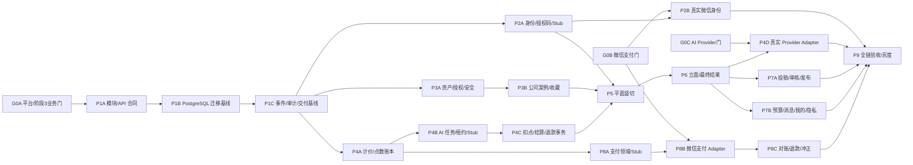

# 众墅之家设计小程序后端实施蓝图 V1.0

> 文档状态：`PROPOSED`  
> 编制日期：2026-09-05  
> 对应架构：[众墅之家设计小程序后端技术架构 V1.0](03-众墅之家设计小程序后端技术架构-V1.0.md)  
> 输入基线：[设计小程序 V1.2 输入基线与追踪](04-设计小程序V1.2输入基线与追踪.md)  
> 边界：这是平台阶段 3/4 的候选实施计划，不表示平台底座、微信、支付、AI 或生产环境已经就绪。

## 1. 交付目标

在已完成的 `zhongshu-ai-platform` 底座上，以可回滚的小工作包交付一条完整竖切：

```text
微信身份/授权码
→ 公司案例与资产
→ 平面生成/选择
→ 立面生成/选择
→ 最终结果/预算/下载
→ 投稿/退修/复审/发布
→ 充值/到账/扣点/AI 差额退点/支付整单退款/对账
```

最终业务能力：

- 小程序严格使用已确认的 Admin UniApp 路线，页面由真实 API、真实状态和对象级权限驱动；
- 管理后台可维护公司案例、审核 AI 投稿、一次性交付授权码、维护充值方案、查订单/任务/流水并双人复核人工调点；
- PostgreSQL 是账号、资产、设计、任务、余额、订单、审核、授权和审计的唯一真相源；
- AI Runtime 可多实例领取、续租和回写，旧租约不能覆盖新状态；
- 请求 N 个结果时按有效槽位结算：0 个全退，1～N-1 个差额退，N 个全额结算；
- 支付事实、权益到账、渠道退款和点数冲正分别幂等、可查询、可补偿；
- 公开展示与生成参考使用同一版本化授权真源，但用途完全分开。

## 2. 不在本轮范围

- 不新建独立小程序业务后端，不做 SQLite/MySQL 与 PostgreSQL 双写；
- 不拆微服务，不引入 Kafka、RabbitMQ、Nacos、Dubbo、Seata 或新 ORM；
- 不建设多 Provider 智能路由、会员体系、CRM、施工管理、正式工程报价；
- 不把当前原生小程序原型直接定为生产主工程；
- 不在 D-10 前固化微信支付参数/虚拟商品规则，不在 D-11 前实现真实 AI Adapter；
- 不以 Mock、截图、健康检查或 CI 绿灯冒充真实微信、支付、Provider 或生产验收。

## 3. 三层启动门禁

三层门分别解锁不同范围，不再用一个 G0 同时表示“Stub 可开发”和“真实集成已获准”。

### G0A：平台与阶段 3 业务门

必须具备：阶段 0、1A、1B、阶段 2/D-07 的验收证据；D-04 Admin UniApp 决策；D-09 身份/组织模型；产品合同、输入 Hash 与受控归档 URI；唯一、可取回的干净 Git 实现基线。

通过后允许：P1A/P1B/P1C、P2A、P3A/P3B、P4A/P4B/P4C、P5/P6、P7A/P7B、P8A 的领域合同、数据库、通用基础设施、Stub 和自动化验证。本专项即承担“设计”阶段 3，不要求先完成包含自身的整个阶段 3。

### G0B：真实微信与支付门

D-10 必须完整关闭：小程序主体、AppID、合法域名、商户与商品路径、回调、订阅消息、凭据责任人、iOS/虚拟商品合规，以及“仅全单退款、点数可全额回收才受理”的 P0 售后规则均有签字。

通过后只解锁：P2B 真实 code2session、P8B 微信支付 Adapter、P8C 真实退款与对账。未通过时这些包保持关闭，P2A/P8A 仍可使用 Stub 做 `AUTOMATED_VERIFIED`。

### G0C：真实 AI Provider 门

D-11 必须完整关闭：首个平面/立面 Provider、请求/回调、取消/超时、Provider 成本、有效结果判定、数据处理、内容安全和质量底线。

通过后只解锁 P4D 真实 Provider Adapter。未通过时 P4B～P7 可在 Stub 下做领域与页面自动化验证，但不得标记真实生成链路。

## 4. 工作包依赖



允许并行：P2A、P3A、P4A 在 P1C 后可分支；P7A 与 P7B 在 P6 后可并行。禁止并行：P4B/P4C、P5/P6、P8A/P8B/P8C 是事务语义递进，必须顺序完成。

## 5. 工作包定义

每个包遵循同一规则：先写失败测试，最小实现使其通过，运行受影响测试与静态检查，审阅完整 diff。一个包控制在 1～3 个逻辑提交；数据库迁移先独立提交，随后提交实现/测试，所有提交使用中文 Lore 协议。迁移前缀和目录由 G0A 在真实父工程中冻结，本文不臆造尚不存在的编号。

### P1A：模块骨架与 API 合同

**实现**

- 在既有 RuoYi 父工程中新增四个模块：`identity`、`design`、`commerce`、`ai-orchestration`；不创建第五个“通用业务”模块。
- 固定 `/app-api/design/v1`、`/admin-api/design/v1`、`/internal-api/design/v1`。
- 复用 `CommonResult<T>`、`PageResult<T>`、底座鉴权、租户、审计和异常处理；JSON 使用 `camelCase`。
- 先写 OpenAPI/DTO/稳定业务错误码和权限点，不实现真实微信、支付或 Provider。

**验证**：模块依赖方向测试、OpenAPI 快照、响应壳/分页/错误码合同测试、禁止 Controller 跨模块 Mapper 的架构测试。

**退出**：三个 API 分面可启动，空实现能返回统一合同；无新依赖、无第二套响应壳。

### P1B：PostgreSQL 迁移与约束基线

**实现**

- 固定迁移工具、目录、命名、事务、回滚/恢复、测试夹具和 PostgreSQL 版本合同；建立一个最小示例迁移证明链路。
- 固定领域表通用列、ID/时间/版本/审计约定，以及唯一约束、外键、状态 CHECK、金额/点数非负约束的写法。
- 具体领域表由 P2A、P3A/P3B、P4A/P4B/P4C、P5、P6、P7A/P7B、P8A/P8C 各包自己的首个独立迁移创建，避免一次建立尚未验证的全域 Schema；P8C 仍受 G0B 约束。
- 每个迁移有逆向脚本或明确 restore-before-change 方案；大表未来变更遵循“加可空列→回填→加约束”。

**验证**：全新库升级、逐步升级、回滚演练、约束红灯、真实 PostgreSQL 并发夹具。

**退出**：空库升级、回滚与真实 PostgreSQL 测试夹具可重复；禁止 H2/SQLite 冒充 PostgreSQL 合同测试。

### P1C：可靠事件、审计与异步交付基线

**实现**

- 优先复用阶段 0～2 已验收的 Infra；缺失时在底座 Infra 扩展，不新增业务微服务或让其他模块依赖 AI 编排。
- 创建/复用 `outbox_event`、`audit_event`、`export_job`、`one_time_delivery_ticket`、`one_time_download_ticket` 和 dispatcher 租约。
- 暴露 `ReliableEventPort`、`AuditPort`、`DeliveryPort`；各业务事务只写自己的事件/交付请求。

**验证**：事务回滚不留事件、提交后至少一次投递、重复投递幂等、dispatcher 崩溃重领、导出/票据过期与越权。

**退出**：P2A、P3B、P4A/B/C、P7A/B、P8A 可在不反向依赖 AI 模块的前提下写 Outbox、审计或异步交付。

### P2A：微信身份领域、受限会话、授权码与 Stub

**实现**

- `WechatIdentityPort` Stub 先跑通 `login code → appid/openid → Account`；P2B 再替换真实 code2session Adapter。
- 首个独立迁移只创建本包的 account、wechatIdentity、accessCodeBatch（含 deliveryMode/交付状态）、accessCode、redemption、accessGrant 与 session 表及约束；一次性交付票据复用 P1C。
- 未授权账号只获受限会话，可查准入状态、协议和兑换授权码。
- 授权码使用密码学安全随机源并保证至少 128 bit 熵；仅保存带版本服务端 pepper 的 HMAC-SHA-256，pepper 进入密钥托管；同事务完成锁码、兑换事实、AccessGrant、码 `CONSUMED`。
- 批次固定 `deliveryMode=INLINE|TICKET`，两种完整码交付互斥且仅一次：INLINE 在创建响应内消费展示机会；TICKET 先原子消费一次性票据再流式输出加密私有文件。列表/日志/搜索/普通导出只显示掩码，失败重放不得再次得到明文。
- 后台解绑只撤销 AccessGrant，旧码永不复活；会话与授权撤销实时生效。

**验证**：随机源/熵和 pepper 版本合同、INLINE/TICKET 互斥、票据并发只消费一次且响应重放不泄漏、同一码 20 路并发仅一人成功、同微信重复兑换幂等、跨 AppID/账号绑定拒绝、过期/停用/撤销、暴力限流、明文泄漏扫描。

**退出**：页面 16 与“我的”授权态由 API 驱动；批量发码有短时单次交付和审计。

### P2B：真实微信身份 Adapter（G0B 后）

**实现**：使用密钥托管的 AppID/Secret 接入 code2session，校验外部错误、超时和会话更新；不改变 P2A 领域模型。

**验证**：真实测试主体登录、错 code、错 AppID、超时、重复登录、凭据轮换和日志脱敏。

**退出**：只证明受控真实微信身份链；授权码、支付和生产放行仍按各自证据分层。

### P3A：资产、权利授权与上传安全

**实现**

- 私有 COS 上传票据、完成校验、输入与 AI 输出隔离区、扫描通过、短期下载票据；Runtime 仅获任务前缀权限。
- 首个独立迁移只创建本包的 asset、scan、rightsGrant 及必要资产关联表；下载票据复用 P1C 的 `one_time_download_ticket`，本包不重复建表。
- 用户草图 JPG/PNG ≤10MB；后台案例 JPG/PNG/PDF ≤20MB；服务端校验魔数、像素、页数、解压后大小和解析超时。
- 移除 EXIF/GPS，接入内容安全 Adapter，保留原始 Hash、来源、父资产和衍生链。
- 建立唯一版本化 `asset_rights_grant`：权利人、授权人、用途、地域、证明、有效期、撤回和父授权。
- 撤回生成参考许可立即阻止新任务引用；撤回公开展示许可后，列表、详情和下载立即拒绝，CDN/缓存清理异步完成；已接受任务保留授权版本快照与审计。

**验证**：伪 MIME、超限、解压炸弹、恶意文件、EXIF、越权 object key、短链过期、AI 输出非法 object key/Hash/格式/解码资源/内容安全、授权到期/撤回、仅公开不可生成、公开许可撤回后读链路即时拒绝。

**退出**：资产未通过安全和授权校验时，不能下载、发布或进入 Provider。

### P3B：公司案例、户型库与收藏

**实现**

- 公司案例草稿、不可变版本、资产关系、发布/下架事实。
- 首个独立迁移只创建本包的 case、caseVersion、caseAsset、publication 与 favorite 表及约束。
- 首页聚合、来源/风格/层数/面积筛选、稳定游标分页、详情、收藏列表。
- 后台新增/编辑/预览/上下架、批量操作逐项结果；大批量导出转异步任务。

**验证**：同面积不重页/漏页、下架即时不可见、旧版本不可篡改、收藏并发幂等、批量半失败可见、BOLA。

**退出**：页面 01～03 与后台案例页不再依赖演示数组。

### P4A：价格快照、点数账本与双人调点

**实现**

- 版本化平面/立面单价与允许数量；任务创建时冻结规则、单价、数量、总价。
- 首个独立迁移只创建本包的 priceRule、pointAccount、pointLedger 与 manualAdjustment 表及约束。
- 一个点数账户保存 `availablePoints`、`reservedPoints` 和版本号；总余额为两者之和并由只追加账本校验。任务只扣可用点；退款预留只做可用→预留转移，渠道成功后才写冲正流水；Redis 不参与余额判定。
- 人工调点状态为 `DRAFT→SUBMITTED→APPROVED→EXECUTED` 或 `DRAFT→SUBMITTED→REJECTED`；制单人与复核人不同，执行以 adjustmentId 幂等。

**验证**：可用余额不足、多请求并发扣点、扣点与退款预留并发、价格更新竞态、`available+reserved=流水总余额` 不变量、重复执行、同人复核拒绝、反向纠错不删原记录。

**退出**：后台能查询完整流水与异常，但任何角色都不能直接 UPDATE 余额。

### P4B：AI 任务、租约与 Runtime Stub

**实现**

- `ai_job`、attempt、result event inbox、quarantined result 和 settlement 状态机；Outbox 复用 P1C。
- 首个独立迁移只创建本包的 job、attempt、result event inbox、result 与 settlement 表及约束。
- Runtime 主动 claim；Core 以 `FOR UPDATE SKIP LOCKED`、lease expiry、递增 fencing token 发放和续租。
- 旧 fencing token 只用于拒绝陈旧回写；结果事件先落 durable inbox，输出只进入隔离前缀。Inbox 以 `(providerCode, sourceEventId)` 唯一；无源事件 ID 时由 Adapter 确定性合成。拒绝事件可按 attempt 共存，仅对 `ACCEPTED` 候选建立 `(jobId, candidateSlotNo)` 部分唯一约束，并以 Provider output id/任务内内容 Hash 二次去重。
- Core 校验器在事务外做 COS HEAD、object key/Hash、格式、解码资源、内容安全和质量检查；只有 `ACCEPTED` 结果可进入候选和结算。
- Stub 覆盖成功、部分结果、失败、超时、重复/乱序回调、无效输出和取消；P4D 再实现真实 Adapter。
- 取消与结果事件都用短事务锁同一 job 行并递增单调 `decisionSeq`，分别保存 `cancelSeq`、`receivedSeq`；仅尚无 `cancelSeq` 或 `receivedSeq < cancelSeq` 的结果可继续校验。时间戳只作审计；终态 CAS 一旦成功不可改，迟到结果只留诊断。

**验证**：多 Worker 不重复领取、租约过期重领、旧持有者拒绝、同事件重放、旧 attempt 槽位被拒后新 attempt 可填充、两个 ACCEPTED 结果争同一槽位、结果 Inbox/隔离/校验失败、事务启动顺序与锁定/提交顺序相反、相同审计时间戳下的取消竞态、终态后迟到结果、Outbox 可靠投递、服务重启恢复。

**退出**：两个 Core + 两个 Stub Worker 下任务状态仍一致；尚不扣点。

### P4C：任务创建、扣点与槽位结算事务

**实现**

- 独立迁移增加 taskCharge 与结算退款业务键/约束，再接通 P4A 账本和 P4B 任务；不改写已发布迁移。
- 创建任务同事务完成：服务端计价、锁账户、扣点流水、charge、job、outbox。
- 终态同事务完成：只读取已 `ACCEPTED` 且符合取消截止规则的最多 N 个有效槽位，正式候选、settlement、状态、差额/全额退点和 outbox 同进同退；外部扫描/校验不进入该事务。
- 0 个有效结果为 `FAILED/CANCELLED` 并全退；1～N-1 为 `PARTIALLY_SUCCEEDED` 并退缺少槽位；N 个为 `SUCCEEDED`。
- `settlementVersion + reason` 唯一；累计退款 ≤ 原扣点；Provider 多给结果不得多扣点。

**验证**：在“扣点/建任务”“结果 Inbox/隔离校验”“终态/结算/退点/Outbox”每个写点注入崩溃并重放；N=0、1、N-1、N、N+1；取消提交顺序竞态；重复/乱序/迟到回调。

**退出**：余额、流水、任务、结果和结算在任何重试后均满足不变量。

### P4D：真实 AI Provider Adapter（G0C 后）

**前置**：D-11 已冻结首个 Provider 的当前接口、Prompt/工作流/价格版本、回调身份、取消能力、结果期限、数据处理与内容安全合同。

**实现**

- 用领域 `AiProviderPort` 适配一个真实 Provider；所有请求带稳定业务幂等键、连接/读取超时、有限重试、错误分类和脱敏日志。
- Provider 回调或轮询结果只写 P4B 的结果事件 Inbox 和输出隔离区，不绕过 Core 校验器，不直接创建候选或结算。
- 把 Provider 取消能力映射为“尽力取消”；最终业务终态仍由 Core 的 `cancelSeq` 单调顺序、结果校验和 CAS 裁决，时间戳不参与赢家判断。
- 保存 Provider 请求 ID、模型/工作流/Prompt 版本、计费事实与原始事件 Hash；不得把供应商状态直接暴露为客户端业务状态。

**验证**：真实测试环境成功/失败/超时、回调验真、重复/乱序/迟到结果、取消竞态、非法 object key/Hash、损坏/违规输出、Provider 计费与本地记录核对、凭据轮换。

**退出**：仅可标 `STAGING_VERIFIED`；真实受控用户生成、结算和内容安全闭环完成前不得标 `REAL_CHAIN_VERIFIED`。

### P5：平面生成竖切

**实现**

- 自主设计/参考案例建项目、需求快照、草图或案例版本引用、平面任务、进度、候选和选择。
- 首个独立迁移只创建 project、requirementSnapshot、candidate、selection 表；不重复创建 P4B 的任务表。
- 创建任务事务内锁定参考案例版本，校验当前 `GENERATION_REFERENCE` grant 并冻结 rightsVersion。
- 重新生成新建任务/候选，不覆盖旧结果；选择使用乐观锁。

**验证**：页面 04～07 主链；仅公开案例不可引用；授权撤回后新任务拒绝、已接受任务可审计；刷新/后台切换/重复点击；对象级权限。

**退出**：授权用户能从真实 API 完成平面生成与选择，点数结算准确。

### P6：立面、最终版本、调整与下载

**实现**

- 立面配置快照、引用已选平面及资产 Hash、立面任务/候选/选择。
- 首个独立迁移创建 resultVersion、revisionRequest 及必要关系；沿用 P5 项目/候选表。
- 生成不可变 `design_result_version`；调整请求生成新版本，保留历史关联。
- 项目列表、结果版本列表、详情、一次性下载票据；最终平面与立面同项目、同阶段关系。

**验证**：未选平面不能生成立面、跨项目候选拒绝、旧版本可读不可改、重复选择幂等、调整链、下载票据/越权/过期。

**退出**：页面 08～11 和“我的→设计记录”完整可用。

### P7A：发布校核、退修复审、授权与上架

**实现**

- 服务端校核必填参数、资产、结果版本、内容安全和许可范围。
- 首个独立迁移创建 submission、submissionRevision、reviewTask、reviewDecision；发布复用 P3B publication。
- 投稿 revision 不可变；支持 `CHANGES_REQUESTED→RESUBMITTED→IN_REVIEW` 多轮审核。
- 用户授予许可，审核决定合规性，发布是独立命令；三者不得合并成一个布尔值。
- 审核通过且公开许可有效才可上架；生成参考许可单独判定；撤回后阻止新引用并保留证据链。

**验证**：投稿人自审拒绝、客户端伪造状态无效、要求修改/重提、审核后未发布、许可过期/撤回、批量审核逐项幂等。

**退出**：页面 12、投稿列表/详情/重提和后台审核/发布形成完整闭环。

### P7B：预算、消息、我的、隐私与客服

**实现**

- 版本化预算规则、输入快照、可复算区间与免责声明；不扩展为正式报价。
- 首个独立迁移创建 budgetRuleVersion、budgetEstimate、message/receipt、privacy/subjectRequest 等本包表；客服入口优先复用配置表。
- Outbox 驱动任务、退款、审核、支付异常和授权失效消息；列表、未读数、已读回执。
- 顶部铃铛是唯一消息入口；“我的”不再重复放消息入口。“我的”聚合设计/收藏/投稿/充值记录、偏好设置、客服配置入口。
- 预算提供列表、详情和重新计算入口，历史预算始终按保存的输入与规则版本展示。
- 协议版本/同意、第三方 AI 处理告知、数据导出、账号关闭和分类保留策略；导出为异步一次性票据。

**验证**：历史预算不漂移、消息重复投递幂等、列表独立空态、导出过期、关闭账号吊销会话、依法留存账务、Provider 最小字段合同。

**退出**：页面 13～15 的所有可见入口都有 API、空态、错误态和权限边界。

### P8A：通道无关支付领域与 Stub

**实现**

- 充值方案版本、订单快照、`PaymentState`、`FulfillmentState`、notification inbox、payment transaction、recharge credit、refund/reversal 模型。
- 以独立小迁移依次创建方案/订单、Inbox/支付事实、credit、refund/reversal，避免一次不可审查的大迁移。
- `PaymentPort` Stub 模拟预支付、通知、主动查单和整单全额退款；不放微信专属字段进领域模型，P0 不提供部分现金退款。
- 支付事实事务与权益到账事务分开；到账事务原子写唯一 credit、基础/赠送流水、余额和 Outbox。
- 退款申请事务锁订单和点数账户；仅当到账后从未发生设计点扣减且当前可用点足额时，才把该订单全部基础/赠送点转入预留。渠道调用在事务外，失败释放预留，未知保持预留并主动查单，成功后由重试事务写冲正。

**验证**：重复/乱序通知、订单金额不符、支付成功但到账进程崩溃、重复补偿、基础/赠送拆分、客户端伪造成功页、整单退款预留/释放/冲正、已有扣点时返回 `REFUND_POINTS_ALREADY_USED`、部分现金退款返回 `REFUND_POLICY_NOT_ENABLED`。

**退出**：页面 17～18 在 Stub 下明确显示支付状态与到账状态，不把两者混为一个“成功”。

### P8B：微信支付 Adapter（D-10 后）

**前置**：D-10 所有字段和当前官方规则已复核；凭据进入密钥托管，禁止入库、日志、测试夹具或 Git。

**实现**

- 使用届时官方 API v3 SDK 完成预下单、签名、通知验签/解密、关单、查单和渠道退款。
- 通知入口先持久化唯一 Inbox，再在渠道时限内 ACK；后台异步推进支付事实与权益到账。
- 对超时 `PENDING/UNKNOWN` 主动查单；网络错误、业务拒绝和最终失败分类处理。

**验证**：官方测试环境/沙箱合同、错签名/错商户/错金额、重复通知、通知丢失、查单恢复、超时和凭据轮换演练。

**退出**：只能标 `STAGING_VERIFIED`；尚未完成真实受控支付不得标 `REAL_CHAIN_VERIFIED`。

### P8C：对账、退款与点数冲正

**实现**

- 支付成功未到账、到账状态失败、渠道/本地差异进入带租约补偿和死信处置。
- P0 只受理整单全额退款：到账后存在任一设计点扣减流水或可用点数不足均拒绝，不形成负余额/用户债务；不支持部分现金退款。
- 受理事务先全额预留该订单基础/赠送点，不写冲正；渠道调用在事务外。明确失败释放预留，未知保持预留并查单，成功后独立重试事务写两类冲正。
- 渠道退款单、退款事实、点数预留/冲正分别幂等；累计渠道退款不得超过原实付，基础/赠送点冲正分别不得超过原发放值。
- 对账动作全审计；人工只能触发受控命令，不能直接改订单、credit 或账本。

**验证**：整单全退、部分现金退款拒绝、重复退款回调、到账后已有扣点的预期拒绝、预留后渠道失败/未知/成功、渠道成功而本地冲正失败的补偿重放、日终差异报表。

**退出**：订单、支付、到账、退款、冲正五类事实可独立查询并对平。

### P9：全链验收、恢复演练与灰度

**实现/验证**

- 至少两个 Core、一个 dispatcher、多个 Runtime Worker；验证会话、租约、fencing、Outbox、结算和到账一致性。
- 小程序全链：授权→平面→选择→立面→结果→预算/下载→投稿→退修→复审→发布。
- 商业全链：方案→订单→支付→Inbox→支付事实→到账→AI 扣点/差额退点→支付整单退款→渠道退款/点数冲正→对账。
- 安全：BOLA、租户伪造、上传攻击、许可撤回、授权码暴力/泄漏、支付重放、越权导出、敏感日志扫描。
- 恢复：PostgreSQL 备份/PITR、COS 清单恢复、密钥轮换、Provider/微信/COS 故障降级、死信人工处置。
- 先内部白名单灰度；真实付费、对外发码、生产 COS、灰度扩大和公网发布必须获得明确授权。

**退出**：分别保存 `AUTOMATED_VERIFIED`、`STAGING_VERIFIED`、`REAL_CHAIN_VERIFIED` 证据；监控、告警、回滚、业务签字完成后才可申请 `PRODUCTION_GO`。

## 6. 四条不可拆事务边界

| 事务 | 必须同一 PostgreSQL 事务提交 | 明确不包含 |
|---|---|---|
| 兑换授权码 | 锁码、兑换事实、AccessGrant、码已消费、审计 Outbox | code2session 外部调用 |
| 创建 AI 任务 | 计价快照、锁账户、扣点流水、charge、job、Outbox | Provider 调用 |
| AI 终态结算 | 已校验有效结果的正式候选、终态、settlement、差额/全额退点流水、余额、Outbox | Provider 调用、COS/格式/内容安全/质量校验 |
| 充值到账 | 唯一 rechargeCredit、基础/赠送流水、余额、fulfillment、Outbox | 支付通知验签、渠道退款 |

外部调用必须在事务外，以 Inbox/Outbox、幂等键和状态 CAS 衔接。禁止打开数据库事务后等待微信、COS 或 Provider。

## 7. API 与页面验收合同

- 响应统一 `CommonResult<T>`，JSON `camelCase`，客户端不从文案推导状态。
- 创建任务、订单、投稿、重提、调整、导出等命令使用 `Idempotency-Key` 或服务端稳定业务键。
- 业务对象返回 `allowedActions`；服务端仍逐次做资源、动作、归属与字段权限检查。
- 每个页面必须同时验收：加载、成功、空数据、可重试失败、无权限、并发冲突和恢复后状态。
- 页面/API 完整矩阵以架构文档 §4、§7.5 为正本，OpenAPI 快照在 P1A 起持续锁定。

## 8. 关键故障注入矩阵

| 故障点 | 通过标准 |
|---|---|
| 授权码锁定后进程退出 | 整体回滚；重试可成功且只消费一次 |
| 扣点后、job 提交前退出 | 扣点与 job 均不存在，或重试返回同一完整事务结果 |
| Runtime 旧租约回写 | 被 fencing 拒绝，不改变结果/终态 |
| 结果写入中重复回调 | 源事件 Inbox 可幂等重放；每个 candidateSlotNo 最多一条 `ACCEPTED` 结果，拒绝结果不占死槽位 |
| Runtime 返回错误 object key/Hash 或损坏/违规文件 | 只停留在隔离区并标 `REJECTED`，不创建候选、不参与结算 |
| 取消与结果同时到达 | 同锁递增 `decisionSeq`，按 `receivedSeq < cancelSeq` 裁决；事务启动先后/相同时间戳不影响结果，终态 CAS 后不可改 |
| 结果已齐、结算提交前退出 | 重试后只产生一个 settlement，退款不超扣款 |
| 请求 N 却返回 N+1 | 只接受/计费 N 个；多余结果留诊断不进入用户候选 |
| 支付通知 Inbox 落库后退出 | 渠道可安全重发；后台最终处理且不重复到账 |
| 支付通知永久丢失 | 主动查单恢复支付事实和到账 |
| credit 写入中退出 | credit、两条积分流水、余额和 fulfillment 同进同退 |
| 重复渠道退款/冲正 | 累计退款/冲正受上限约束，原账不可删除 |
| 退款前已有任一设计点扣减 | 返回 `REFUND_POINTS_ALREADY_USED`，不创建退款单、不形成负余额 |
| 退款预留后渠道失败/未知/成功 | 失败释放、未知保持并查单、成功转冲正；各路径可幂等恢复 |
| 授权撤回与新任务并发 | 新任务在同事务校验中失败；已接受任务有授权版本快照 |
| 批量审核/导出半失败 | 每项结果可见、可重试；成功项不被重复执行 |

## 9. 质量、发布与回滚门禁

每个工作包收尾按以下顺序：

1. 格式化、lint、类型检查、架构/静态规则；
2. 受影响单元、PostgreSQL 集成和合同测试；里程碑再跑全量；
3. 依赖漏洞与 changed-files 密钥扫描；
4. 完整 diff 自审：死代码、调试输出、错误处理、外部超时、日志敏感字段、迁移可逆性；
5. 启动应用与最小页面/API smoke；
6. 使用中文 Lore 提交，写明 `Tested`、`Not-tested`、风险和回滚；
7. 更新状态账本与证据，禁止仅因“代码存在”跨越证据等级。

数据库变更默认通过向后兼容迁移回滚应用；若数据语义不可逆，先备份/校验再执行，并在提交中标 `Reversibility: messy`。禁止以删除生产数据作为常规回滚。

## 10. 首个可执行动作

当前只有设计文档，没有已验收平台代码，因此先执行 G0A：核验阶段 0、1A、1B、阶段 2/D-07 与 D-09，确认输入哈希、受控归档 URI 和唯一实现仓库；通过后从 P1A 开始，P2A/P3A/P4A 在 P1C 后并行。G0B、G0C 分别等待微信支付与 AI Provider 决策，只阻断 P2B/P8B/P8C 与 P4D，不反向阻断领域/Stub 研发。
